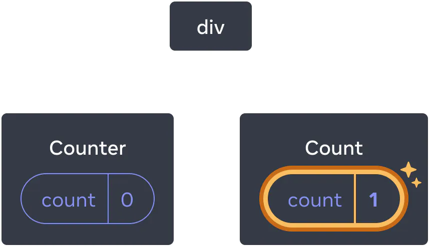
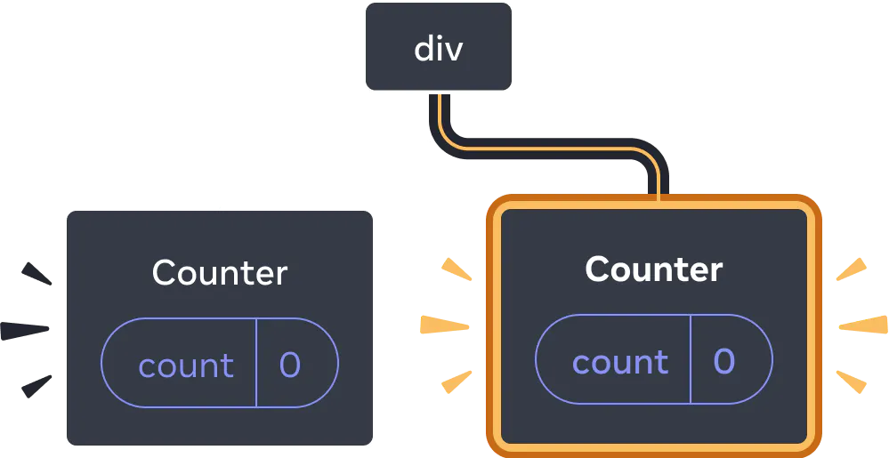

# React Hooks —— 状态管理篇


## 前言

最近项目正在迁移到 `React` 技术栈，使用的是 `React  Hook`。在实际使用过程中，心中多多少少有这样或那样的疑惑，于是学习了相关资料和文档。并总结成了本篇文章，本文内容多来源与英文版 `React beta` 文档，我按自己的理解将其翻译了过来，如有不正确的地方，还望各位指正。

下面进入正题。

## useState Hook

在聊 `useState` 钩子之前我们说说 **`state`** 。至 `React` 诞生以来，组件化开发的思想可以让我们像搭积木一样来搭建整个页面，并且可以通过组件抽离，实现组件 `UI` & 逻辑的复用。

在开发过程中，我们由原来的**命令式编程**方式转为了**声明式编程**。这里举一个比较简单的场景可以让你明白这两种方式的区别，假设有一个表单填写的需求，需要用户回答一个问题，但是有些交互需要处理：

- 当用户在 `input` 标签中输入文本时， `Submit` 按钮由 `disable` 不可点击的状态变为 `enabled` 可点击状态。
- 当用户点击  `Submit` 按钮后，表单和按钮都变为 `disable` 状态，并且展示一个 `loading` 的状态。
- 如果 `HTTP` 请求成功，则隐藏表单，并且显示 ”Thank you“ 消息。
- 如果 `HTTP` 请求失败，则显示错误提示信息，并且表单再次变为 `enabled` 可以编辑的状态

如果你使用**命令式编程**的方式，你的代码可能会是下面的样子：

```jsx
// 提交表单
async function handleFormSubmit(e) {
  e.preventDefault();
  disable(textarea);
  disable(button);
  show(loadingMessage);
  hide(errorMessage);
  try {
    await submitForm(textarea.value);
    show(successMessage);
    hide(form);
  } catch (err) {
    show(errorMessage);
    errorMessage.textContent = err.message;
  } finally {
    hide(loadingMessage);
    enable(textarea);
    enable(button);
  }
}
// 文本框状态切换
function handleTextareaChange() {
  if (textarea.value.length === 0) {
    disable(button);
  } else {
    enable(button);
  }
}
// 隐藏
function hide(el) {
  el.style.display = 'none';
}
// 展示
function show(el) {
  el.style.display = '';
}
// 可以点击 或 编辑
function enable(el) {
  el.disabled = false;
}
// 禁止点击或编辑
function disable(el) {
  el.disabled = true;
}
// 提交按钮
function submitForm(answer) {
  // Pretend it's hitting the network.
  return new Promise((resolve, reject) => {
    setTimeout(() => {
      if (answer.toLowerCase() == 'istanbul') {
        resolve();
      } else {
        reject(new Error('Good guess but a wrong answer. Try again!'));
      }
    }, 1500);
  });
}

let form = document.getElementById('form');
let textarea = document.getElementById('textarea');
let button = document.getElementById('button');
let loadingMessage = document.getElementById('loading');
let errorMessage = document.getElementById('error');
let successMessage = document.getElementById('success');
form.onsubmit = handleFormSubmit;
textarea.oninput = handleTextareaChange;
```

可以看到使用命令式编程的方式时，你必须通过代码来描述清楚每个交互操作后的具体逻辑，根据 **交互场景去操作 DOM**，来实现视图的切换响应。

这就好比你打了一辆出租车，但是司机(**`JS`**)并不知道目的地在哪，你必须在每个交叉路口告诉司机该如何驾驶。


但是如果使用 `React` 的话，则不必这么复杂。在 `React` 中你不需要去操作 `DOM` 去改变 `UI` 的 `enable、disable、show` 或者 `hidden` 效果。你只需要将你想要展示的效果告诉  `React`  就好。 `React`  会通过计算更新 UI。如果使用**声明式编程**的方式，你的代码最终可能是这样的：

```jsx
import { useState } from 'react';

// 表单组件
export default function Form() {
  // 声明答案状态变量
  const [answer, setAnswer] = useState('');
  // 声明错误变量
  const [error, setError] = useState(null);
  // 声明状态变量
  const [status, setStatus] = useState('typing');

  if (status === 'success') {
    return <h1>That's right!</h1>
  }
	// 处理提交
  async function handleSubmit(e) {
    e.preventDefault();
    setStatus('submitting');
    try {
      await submitForm(answer);
      setStatus('success');
    } catch (err) {
      setStatus('typing');
      setError(err);
    }
  }
	// 编辑事件
  function handleTextareaChange(e) {
    setAnswer(e.target.value);
  }

  return (
    <>
      <h2>City quiz</h2>
      <p>
        In which city is there a billboard that turns air into drinkable water?
      </p>
      <form onSubmit={handleSubmit}>
        <textarea
          value={answer}
          onChange={handleTextareaChange}
          disabled={status === 'submitting'}
        />
        <br />
        <button disabled={
          answer.length === 0 ||
          status === 'submitting'
        }>
          Submit
        </button>
        {error !== null &&
          <p className="Error">
            {error.message}
          </p>
        }
      </form>
    </>
  );
}
// 提交函数
function submitForm(answer) {
  // Pretend it's hitting the network.
  return new Promise((resolve, reject) => {
    setTimeout(() => {
      let shouldError = answer.toLowerCase() !== 'lima'
      if (shouldError) {
        reject(new Error('Good guess but a wrong answer. Try again!'));
      } else {
        resolve();
      }
    }, 1500);
  });
}

```

上面的代码使用**声明式编程**方式实现，代码量可能与 前者相差无几，但是可以看到，声明式编程少了一些 DOM 操作，多了一些状态判断。

这就好比你打了辆出租车，你仅需要告诉司机(**`React`**)目的地即可，而不是告诉司机该如何拐弯、如何行进。司机的工作就是将你载到目的地，司机可能还知道一些近道。


通过上面的代码案例，你会发现，你编程的**关注点**在发生变化：

- 在**命令式编程**的方式中，你关注的是如何在交互中通过**操作 `DOM`** 的方式，达到视图切换的效果
- 在**声明式编程**的方式中，你关注的是如何通过**维护状态变量**的方式，达到视图切换的效果

**在 `React` 中，我们将组件需要缓存下来的用于维护组件的展示状态的变量，比如：输入框中的文本 `answer`、请求状态 `error`、响应状态 `status`**，称为 `state`（状态）。`state` 会存在于 `React` 组件的整个生命周期内。

通过上面简单的介绍，接下来我们具体聊聊如何使用 `useState`。

**`useState` 钩子主要用来为函数 `component` 组件提供状态管理的能力**。主要负责：

- 在组件渲染更新期间，维持组件状态。
- 会返回一个 `setter` 函数，可以用来更新状态，并触发 `React` 对组件的重新渲染。

它可以接受一个 `init` `state` 作为参数，当调用执行的时候会返回一个包含两个元素的数组：

- 第一个元素是当前 `state`。
- 第二个元素是一个 `setter` 函数，用来更新 `state`，通常以 `set` 作为前缀。

使用公式：

```js
const [state, setState] = useState(initState)
```

计数器组件示例：

```jsx
import { useState } from 'react';
// 计数器组件
function CountButton() {
  // 初始化 state
  const [count, setCount] = useState(0)
  
  const onClick = () => {
    setCount(count + 1)
  }
  
  return (
    <button onClick={onClick}>
    	{ count }
    </button>
  )
}
```

- 当点击 `button` 的时候，会通过 `setCount` 更新 `count`，`count` 发生改变， `React` 会重新渲染组件。

### 理解两个关键阶段: `render` & `commit`

在组件展示在视图之前，必须经过 `React`  渲染。理解这两个阶段有助于你理解代码执行的过程和行为。

我们这里打一个比喻：

假设一个餐厅点餐的场景，主要角色有：厨师、服务员和顾客。我们将你编写的组件视为餐厅的厨师，可以根据顾客的订单制作菜品。将 `React` 视为服务员，用于将用户的菜单交给厨师。将顾客视为触发页面交互的用户，将需要渲染给顾客的组件视为菜单。

<center class="half">
  
  
  
  
  
<center>

则整个渲染过程为：

1. **触发**渲染，可以视为服务员将顾客点的菜单交个厨师。
2. **渲染**组件，可以视为厨师最备好菜品。
3. **提交**到 DOM，可以视为服务员将菜品呈送给顾客。

下面分析下上面三步主要发生了什么：

#### 第一步：触发渲染

在通常情况下，会有两种情况会触发渲染：

1. 在组件初始化阶段，进行**初始渲染**。
2. 当组件的**状态发生更新**时，触发渲染。

##### 初始渲染

当应用启动时，需要通过 `React` 的 `createRoot` 方法获取挂载节点，并调用其返回对象上的 `render` 方法，将组件渲染到视图上：

```jsx
import { createRoot } from 'react-dom/client';
// 自定义组件
function Image() {
  return (
    
  );
}
// 初始渲染
const root = createRoot(document.getElementById('root'))
root.render(<Image />);

```

##### 状态更新时的重新渲染

当组件已经完成初始渲染时，后续你可以通过使用 `setter` 函数更新状态的方式再次触发渲染。更新状态操作会将本次的渲染任务放到渲染队列中，进行渲染。你可以把这想象为餐馆的顾客在点完第一份菜后(完成第一次渲染)，根据他们的口渴或饥饿的状态(更新状态)，又点了茶、甜点和各种各样的东西(再次触发渲染流程)。

<center class="half">
  
  
  
  
  
<center>

#### 第二步：`React` 渲染组件

在你触发渲染后，`React` 会通过调用函数组件计算出最终需要渲染到视图上的内容。**”渲染“就意味着 `React` 在调用你的函数组件**：

- 在首次渲染时，`React` 会调用根组件。
- 在后续进行更新渲染时，`React` 会调用由于状态更新而触发渲染的函数组件。
  - 整个渲染过程是以递归的方式进行的：如果被更新的组件返回了其他组件，`React` 则会继续渲染该组件，如果该组件返回了一些其他内容，那么接下来将渲染该组件，以此类推。该过程将持续进行，直到不再有嵌套组件，React 确切地知道应该在视图上显示什么。

- 在初次渲染时，`React` 会将 `html` 标签创建转化为 `DOM` 节点
- 在更新渲染时，`React` 会计算它们的哪些属性(如果有的话)自上一次渲染以来发生了变化。在下一步**提交**阶段之前，它不会对该信息做任何处理。

#### 第三步：`React` 将更改提交给 `DOM` 对象

在组件渲染之后，`React` 将更新 `DOM` 对象：

- 对于初次渲染，`React` 会通过 `appendChild()`DOM` API `将所创建的所有 DOM 节点更新到视图上。
- 对于后续的更新渲染，`React` 将通过 `diff`  算法，计算出应用最小的必要操作数(在渲染时计算!)，以保证 DOM 与最新的渲染输出 DOM 匹配。

**`React` 仅会在两次渲染结果之间存在差异时才进行更新操作。**例如，下面一个组件，它使用从其父组件传递的 `time` 属性每秒重新渲染一次。可以注意到，当你在 `<input>` 中输入一些文本，更新它的值后，在组件重新渲染时，文本不会消失:

```jsx
export default function Clock({ time }) {
  return (
    <>
      <h1>{time}</h1>
      <input />
    </>
  );
}

```

这是因为在最近的一次渲染中，`React` 只使用新的 `timer` 更新了 `<h1>` 的内容。它可以看到 `input` 标签在 `JSX` 中出现在与上次相同的位置，因此 `React` 不会更新 `<input>` 标签及它的值!

#### 最后：浏览器绘制

在渲染完成并且 `React` 更新了 `DOM` 之后，浏览器将重新绘制视图。其实这个过程也被称为“浏览器渲染”，但 `React` 将其称为“绘制”，主要是避免与文档的其余部分造成混淆。


### 理解 `state` `snapshot`

在正常的 `JavaScript` 执行的心智模型中，函数中的代码块是由上到下一行一行的执行的。但是 `React` 函数组件中的状态变量与 `JavaScript` 变量在函数中的表现行为并不一样。

先看下面一段代码示例：

```jsx
import { useState } from 'react';

function CountButton() {
  // 初始化 state
  const [count, setCount] = useState(0)
  
  const onClick = () => {
    console.log(count) // 0
    setCount(count + 1)
    console.log(count) // 0
  }
  
  return (
    <button onClick={onClick}>
    	{ count }
    </button>
  )
}

```

- 上面代码初始状态为 `0`，点击 `button`，会执行 `onClick` 函数
- 以通常的思维，代码的执行过程是：打印 `0`、执行 `setCount`, `count` 加 `1` 、打印 `1`
- 但是实际效果却是：打印 `0`、执行 `setCount`, `count` 加 `1` 、打印 `0`。

**这是为什么？**

我们知道 `React` 触发渲染的方式有两种：

- 一种是在组件初始化阶段进行的渲染。

- 另一种就是通过执行 `setter` 函数更新状态变量，重新触发渲染。

你会发现执行 `setCount` 函数后，并没有立即更新 `count`。第二个 `console` 访问的还是当前的状态，`setCount` 的表现行为更像是一个异步的函数。

- 当 `setter` 函数改变 `state`，再次触发渲染时，`React` 会调用函数组件。
- 获取一张根据当前状态计算出的新的  `JSX`  快照。
- `React` 会将新的 `JSX` 快照与视图进行对比更新。

<center class="half">
  
  
  
  
  
<center>

作为 `React`  的状态存储器，`state` 并不会在组件函数执行完后立即销毁，而是一直存在于 `React` 上下文中，`React` 会为你保存 `state`。

每次 `React` 重新调用组件函数时，它会为你保存一张当前渲染状态的快照。当视图发生交互事件，通过 `setter` 函数触发重新渲染时。`React` 会首先更新状态快照，并根据状态快照计算一个新的 UI 快照与当前视图进行对比更新。

<center class="half">
  
  
  
  
  
<center>


**每次 `JSX` 快照中的事件所能访问的状态都是基于当前状态快照的中的值**。

我们再来看另一个例子，下面的代码我们期望实现：

- 点击 +1 时，`score` 会增加 1
- 点击 +3 时，通过执行三次 `increment`，使 `score` 增加 3 的效果

```jsx
import { useState } from 'react';

export default function CountButton() {
  const [score, setScore] = useState(0);

  function increment() {
    setScore(score + 1);
  }

  return (
    <>
      <button onClick={() => increment()}>+1</button>
      <button onClick={() => {
        increment();
        increment();
        increment();
      }}>+3</button>
      <h1>Score: {score}</h1>
    </>
  )
}

```

但实际情况是，点击 +3，你会发现，`score` 只进行了一次叠加，并没有像期望的那样。

用 `state snapshot` 就可以很好的解释上面代码发生了什么：

当通过执行 `setScore` 函数，触发重新渲染时，`React` 并不会立即改变当前状态快照，当前快照中的 `score` 是 0 。三个 `setter` 函数在同一状态快照中，仅能访问当前快照中的 `score`，因此每次点击 +3 ，仍然只会进行一次叠加。

过程类似于：

```javascript
console.log(score);  // 0
setScore(score + 1); // setScore(0 + 1);
console.log(score);  // 0
setScore(score + 1); // setScore(0 + 1);
console.log(score);  // 0
setScore(score + 1); // setScore(0 + 1);
console.log(score);  // 0
```

相当于你进行了三次重复的 `0 + 1` 操作。

**在一次渲染中状态变量的值是一直保持不变的**，即使它的事件处理函数是异步的。当 `React` 调用你的组件函数重新获取 `UI` 快照时，它的状态就被固定了下来。

可以通过下面的代码理解下：

```jsx
import { useState } from 'react';

export default function Counter() {
  const [number, setNumber] = useState(0);

  return (
    <>
      <h1>{number}</h1>
      <button onClick={() => {
        setNumber(number + 5);
        setTimeout(() => {
          alert(number);
        }, 3000);
      }}>+5</button>
    </>
  )
}

```

当 `alert` 运行的时候， `number` 已经发生了改变，但是你可以发现点击 +5 ，等待三秒后，`alert` 的 `number` 仍然是上一个状态，这是因为 `React` 使用 `state` 快照进行了调度处理，保证 `alert` 访问的状态仍然是触发 `setTimeout` 时的值。

`React` 中的状态变量更像当前组件状态的一个快照，会以不变的状态一直存在于当前组件函数中。你在本次渲染中通过事件函数能访问的状态，都取决于本次渲染对应的状态快照。

> 用大白话理解：
>
> 如果你用 `JavaScript` 函数执行的过程去理解 `React` 函数组件，就会很好理解**状态快照**的概念。比如说你写了一个函数，会在函数内部做变量声明、内部函数声明、对象变量属性的更改、最终返回一个对象等等一系列操作。
>
> 在你每次调用这个函数的时候，都会走一遍这样的流程：
>
> - 为这个函数创建执行上下文
> - 将执行上下文放入执行栈
> - 释放执行栈
> - 进行垃圾回收等操作。
>
> 这就是说虽然每次函数执行的时候，都在函数内部声明变量 `a`，但是每次声明的 `a` 变量都是一个新的变量，两次函数执行过程中产生的变量 `a` 在 内存中的地址并不相同，每次执行过程中仅能访问当前执行上下文对象中声明的变量。
>
> 在 `React` 组件中，也是同样的道理，不同之处就是 `React` `Hook` 会对状态做些特殊处理，导致你可能以通常的思维方式去理解会与预期不符。

### 理解批量更新

还下面的代码为例：

```jsx
import { useState } from 'react';

export default function ColorBox() {
  const [color, setColor] = useState('black');

  return (
    <div style={{
        backGroundColor: color,
        height: 200,
        width: 200
      }}>
      <button onClick={() => {
       setColor('red');
       setColor('green');
       setColor('yellow');
      }}>Button</button>
    </>
  )
}
```

上面的代码期望在点击 `button` 的时候，可以实现 `div` 背景色的多次切换效果。

但是当你点击的时候就会发现，事情可能并不像预期的那样，而是会直接渲染 `yellow`。这是因为 `React` 会在更新你的 `state` 之前等待所有的事件处理函数运行结束。这其实与上面 +1 的案例相同。

这就好比在餐厅中点餐时，服务员不会等你点了一份菜就直接送给厨师，而是会等你点餐结束并允许你更改菜单，等你确定完最终菜品才递给厨师。甚至中间还会帮助其他顾客点餐。


`React` 允许你更新多个状态变量，甚至更新多个组件的变量，这可以避免触发多次渲染。但是这也意味着 `UI` 只有等到所有的事件处理函数及其他代码运行结束之后，才会更新。这种行为被称为**批处理** 。

注意，`React` 的批处理并不会对用户有意触发的事件有效。比如点击事件，每次点击事件都是独立的。

#### 那如何在下一次渲染前进行多次更新操作？

这种情况通常不多，但是如果你想在下次渲染前多次更新相同的状态变量，你可以在 `setter` 函数中传递一个函数，例如：`setNumber(n => n + 1)`，**这个函数可以基于渲染队列中的上一个状态，计算下一个状态**。

```jsx
import { useState } from 'react';

export default function Counter() {
  const [number, setNumber] = useState(0);

  return (
    <>
      <h1>{number}</h1>
      <button onClick={() => {
        setNumber(n => n + 1);
        setNumber(n => n + 1);
        setNumber(n => n + 1);
      }}>+3</button>
    </>
  )
}
```

上面 `setter` 函数中的 `n =>  n + 1` 会被作为更新函数调用，当你点击 `button` 的时候：

1. 当所有的事件函数运行结束后，React 会将更新函数放进执行队列中等待执行。
2. 当进入下一次渲染时，`React` 会遍历执行队列中的更新函数，得出最终状态。

**当 `React` 执行队列中的更新函数时，会将当前执行的更新函数返回的结果传递给下一个待执行的更新函数**。所以当你点击一次时，就会实现一个 `+3` 的效果。

#### 如果先是以替换的方式更新，然后以更新函数的方式更新状态会发生什么？

```jsx
import { useState } from 'react';

export default function Counter() {
  const [number, setNumber] = useState(0);

  return (
    <>
      <h1>{number}</h1>
      <button onClick={() => {
        setNumber(number => number + 5);
        setNumber(number + 1);
      }}>Increase the number</button>
    </>
  )
}
```

你认为当点击按钮的时候，会增加几？

上面的代码意思是告诉 `React`  应该按下面的方式更新：

1. `setNumber(number + 5)`: `number` 是`0`, 因此 `setNumber(0 + 5)`. `React` 会将任务 *”用`5`替换 `number`“* 放入队列中
2. `setNumber(n => n + 1)`: `n => n + 1` 是一个更新函数。`React` 会将更新函数添加到任务队列中。

在下一次渲染时，`React` 会遍历整个状态队列：

| 更新队列           | `n`            | 返回值      |
| ------------------ | -------------- | ----------- |
| “replace with `5`” | `0` (没有使用) | `5`         |
| `n => n + 1`       | `5`            | `5 + 1 = 6` |

最终 `React` 会将 `6` 作为结果存储起来，并通过 `useState` 返回。

#### 如果两种方式穿插进行，会发生什么？像下面这样

```jsx
import { useState } from 'react';

export default function Counter() {
  const [number, setNumber] = useState(0);

  return (
    <>
      <h1>{number}</h1>
      <button onClick={() => {
        setNumber(number + 5);
        setNumber(n => n + 1);
        setNumber(42);
      }}>Increase the number</button>
    </>
  )
}
```

下面是 `React` 在执行这个事件处理程序时的处理流程:

1. `setNumber(number + 5):`  `number` 为 0，所以 `setNumber(0 + 5)`. `React` 将“用 5 替换状态”添加到队列中。
2. `n + 1` 是一个更新函数。`React` 将该函数添加到它的队列中。
3. `setNumber(42`): `React` 将 “用 42 替换状态” 添加到队列中。

在下一次渲染期间，`React` 将遍历状态队列:

| 更新队列           | `n`            | 返回值      |
| ------------------ | -------------- | ----------- |
| “用 `5` 替换状态”  | `0` (没有使用) | `5`         |
| `n => n + 1`       | `5`            | `5 + 1 = 6` |
| “用 `42` 替换状态” | `6` (没有使用) | `42`        |

然后 `React` 存储 `42` 作为最终结果，并从 `useState` 返回它。

总结一下，其实你可以这样想，当你执行 `setNumber` 函数时在队列中都放了哪些任务？：

- 将 “用 5 替换状态” 添加到队列中。
- 将更新函数 (例如 `n => n + 1` ) 添加到队列中。
- 将 “用 `42` 替换状态” 添加到队列中， 并忽略已经在队列中的任务，例如前面的两个任务等等。

事件处理执行完成后，`React` 将触发重新渲染。在重新渲染时，`React` 将处理队列中的任务。更新函数在渲染期间运行，因此**更新函数必须是纯函数**，并且只返回结果。不要试图从它们内部设置状态或运行其他副作用。在严格模式下，`React` 会将每个更新程序函数执行两次(但忽略第二个结果)，以帮助你查找 `bug`。

### 理解状态可读不可变

1. 对于 `string`、`boolean`、`number` 这种**原始类型的 `state`**。我们会通过 `setter` 函数设置一个新的值，来触发组件重新渲染。如果使用原始值会发生什么？

来看段代码：

- 我们用 `random` 来标记组件是否重新渲染
- 在 `onClick` 的时候，调用 `setter` 函数，给 `setCount` 传递的还是 0 ，状态保持不变

```jsx
import { useState, useEffect } from 'react'

function Counter() {
  const [count, setCount] = useState(0)
  const random = Math.floor(Math.random() * 100000000000)
  return (
    <div>
      <h1 style={{ color: 'red' }}>{random}</h1>
      <h2>{count}</h2>
      <button onClick={() => {
        setCount(count)
      }}>ADD</button>
    </div>
  )
}

export default Counter
```

当你点击 `ADD` 的时候就会发现，虽然调用了 `setCount` 函数，但是组件别没有重新渲染。只有真正通过 `setCount` 函数改变 `count` 时，组件才会触发重新渲染：

```js
setCount(count + 1)
```

这个操作关键的地方在于：你**通过创建一个新的值对原来的状态完成了更新**，并没有更改原来的状态。

2. 我们再来看一下**引用类型的 `state`**，比如说我们定义了一对象：

```jsx
const [position, setPosition] = useState({x: 0, y: 0})
```

我们可以直接在代码中进行更改：

```js
const onClick = () => {
  position.x = 800
  console.log(position)
}
```

当用户触发 `onClick` 事件时，我们更改了 `position` 的 `x` 属性，并且可以通过日志看到 `position` 确实发生了变化。但是并没有触发组件的重新渲染。

这是因为**引用类型**虽然在 `React` 函数组件中是可更改的，但是你需要将其**视为不可变类型**，在更新的时候通过创建一个新的对象，来触发更新操作。

```js
const onClick = () => {
  setPosition({
    ...position,
    x: 800
  })
}
```

上面的代码我们为 `setPosition` 传入了一个新的对象，并通过对原始 `position` 的进行解构操作，来保留不需要更改的属性。

原理是 `React` 源码中对 `state` 的**新旧值进行了浅比较**，只有当新旧状态不同时，才会执行触发更新操作。

**所以在 `React` 中，不管是原始类型还是引用类型的的状态，你都需要将其视为只可读不可变的。**当你想要更新一个状态的时候，就传入一个新的 `value` 通过 `setter` 函数来替换状态吧。

当你理解了 `React` 的状态**可读不可变**逻辑，就能很轻松的学会对象类型与数组类型的操作方法了：

#### 更新对象类型状态

- 对于普通的对象在更新时，给 `setter` 函数传入一个新的字面量对象，通过 `...` 解构运算符保留不需要更改的属性，对目标属性设置新的值
- 对于嵌套类型的对象，同样需要传入一个新的字面量对象，但是需要对对象进行多次解构操作。

```jsx
const [person, setPerson] = useState({
  name: 'Niki de Saint Phalle',
  artwork: {
    title: 'Blue Nana',
    city: 'Hamburg',
    image: 'https://i.imgur.com/Sd1AgUOm.jpg',
  }
});
// 更新外层属性
function handleNameChange(e) {
  setPerson({
    ...person,
    name: e.target.value
  });
}
// 更新嵌套属性
function handleTitleChange(e) {
  setPerson({
    ...person,
    artwork: {
      ...person.artwork,
      title: e.target.value
    }
  });
}
```

#### 更新数组类型状态

- 添加操作，需要用 `concat` 方法或者 `[...arr]` 展开语法
- 删除操作，使用 `filter` 或 `slice` 方法
- 替换操作，使用 `map` 方法
- 排序操作，首先需要对数组进行**浅克隆**操作

```jsx
const [artists, setArtists] = useState([]);
// 添加
setArtists( // Replace the state
  [ // with a new array
    ...artists, // that contains all the old items
    { id: nextId++, name: name } // and one new item at the end
  ]
);

// 删除
setArtists(artists.filter(a => a.id !== artist.id));

// 替换
const nextArtistList = artists.map(item => {
  // 进行一些逻辑操作
});
// Re-render with the new array
setArtists(nextArtistList);

// 排序
const sortArtistList = artists.sort(item => {
  // 进行一些逻辑操作
});
// Re-render with the new array
setArtists(sortArtistList);
```

总之，不管你如何操作数组或者数组中的 `item`，记得给 `setter` 函数一个新的数组吧。

### 惰性初始化

从上文中我们可以知道 `useState` 可以接受任意类型的数据作为初始状态。但有时我们想对初始化的状态先做一些计算操作，比如对数组类型的过滤，并且考虑到初始状态只有在组件的 `mounted` 阶段有用，所以我们期望这些计算操作仅在初始化阶段执行一次就好。那么我们可能这么写代码：

```jsx
import React, { useState } from "react";

function getInitialValue() {
  console.log('状态初始化时会被执行');
  // ...可以添加一些额外逻辑
  return 0;
}

function Counter() {
  const [count, setCount] = useState(getInitialValue());
  function increment() {
    setCount(count + 1);
  }
  return <button onClick={increment}>{count}</button>;
}
```

当你点击 `button` 并查看日志的时候，你会发现：

- `getInitialValue` 函数会在每次触发 `click` 事件的时候执行，这意味着每次渲染的时候都调用了 `getInitialValue` 函数
- 但是 `getInitialValue` 仅在第一次执行的时候是有用的，后面的每次执行结果都会被舍弃，因为后续的状态都使用的是传给 `setter` 函数的值
- 这种行为并不符合我们预期，通常 `getInitialValue` 中很可能做些计算开销很大的操作，这会影响到应用性能

`useState` 也可以接受一个函数作为初始状态。当初始状态是一个函数的时候，`React` 只会在组件的第一次挂着阶段调用函数，获取初始状态，在后续的更新阶段并不会再次调用，因此我们通常可以通过给 `useState` 传入一个函数，让函数做一些计算操作，来获取一个目标初始状态。

如果想要实现仅执行一次的效果，我们可以给 `useState` 传入一个 `callback` `function`，而不是一个函数返回的结果，并且这个 `callback` 被执行的时候会返回初始状态。

代码示例：

```jsx
import React, { useState } from "react";

function getInitialValue() {
  console.log('getInitialValue is getting executed');
  // ... do some expensive operations
  return 0;
}

function Counter() {
  const [count, setCount] = useState(getInitialValue);
  function increment() {
    setCount(count + 1);
  }
  return <button onClick={increment}>{count}</button>;
}
```

上面的代码在初始挂载阶段，你可以在控制台看到执行 `getInitialValue` 输出的日志，当你再点击 `button` 更新 `count` 的时候，发现 `useState` 并没有再次执行 `getInitialValue`，这就是**状态懒加载**。

### 保存与重置状态

我们知道页面的渲染过程可以简单描述为：浏览器将 `HTML` 转为 `DOM` 树，`CSS` 转为 `CSSOM` 树，再将两者合并为渲染树，最终将渲染树渲染到页面中。

在当前组件化开发思想的影响下，我们在开始构建页面的时候，通常会将整个页面视为一颗组件树，然后将其拆分为大大小小的不同组件，组件开发完后，我们会将组件像搭积木一样，再组成页面。


组件之间的状态是独立的，`React` 会根据组件在 **`UI` 树**中的位置去 `Track` 每个组件的状态。**在组件重新渲染的时候，你可以保留或者重置状态。** 

`Counter` 组件：

```jsx
function Counter({ isFancy = false }) {
  const [score, setScore] = useState(0);
  const [hover, setHover] = useState(false);

  let className = 'counter';
  if (hover) {
    className += ' hover';
  }
  if (isFancy) {
    className += ' fancy';
  }

  return (
    <div
      className={className}
      onPointerEnter={() => setHover(true)}
      onPointerLeave={() => setHover(false)}
    >
      <h1>{score}</h1>
      <button onClick={() => setScore(score + 1)}>
        Add one
      </button>
    </div>
  );
}


```

`App` 组件：

```js
import { useState } from 'react';

export default function App() {
  return (
    <div>
       <Counter />
       <Counter />
    </div>
  );
}
```


上面的 `App` 组件的结构如上图所示。



当你点击其中一个计数器时，会发现只有点击的会增加，另一个状态保持不变，这是因为两个组件的状态是独立的。

现在对 `APP` 组件代码做些改动：

```jsx
export default function App() {
  const [showB, setShowB] = useState(true);
  return (
    <div>
      <Counter />
      {showB && <Counter />} 
      <label>
        <input
          type="checkbox"
          checked={showB}
          onChange={e => {
            setShowB(e.target.checked)
          }}
        />
        Render the second counter
      </label>
    </div>
  );
}

```

上面的代码，当你点击 `checkBox` 是可以触发显示或者隐藏第二个 `Counter` 组件，显示或者隐藏操作意味着第二个 `Counter` 组件会从 `UI` 树中消失。


`React` 在这中间的主要作用就是将我们写的 `JSX` 结构转化为一棵虚拟 `DOM` 树，去与浏览器页面的对应结构进行对比，然后更新目标节点。



如果你先对 `Counter` 进行点击，触发 `+1`，那么你会发现在切换的过程中，第二个 `Counter` 每次重新回显的时候，状态会重置为初始值。

当你给一个 `React  component` 定义了一个组件 `state` 变量时，你或许认为 `state` 变量一直存在于组件中，由组件对自己的 `state` 变量进行管理，其实 `state` 变量一直是由 `React` 进行管理的。`React` 会基于组件在 `UI` 树的位置，将其管理的 `state` 变量与组件准确关联起来。

只要组件在 `UI` 树中被渲染，`React` 就会保存其 `state`。并且在后续的更新中， `UI` 树中相同的位置渲染了相同的组件，则 `React` 会一直保存与该组件相关的 `state`。

当你在 `UI` 树中的同一位置(节点)渲染了不同的组件时，`React` 会重置整个子组件树状态。

如果你想要在每次渲染的时候保存组件的 `state` ，则每次重新渲染的 `UI` 树结构必须匹配，如果结构不匹配，当组件从 `UI` 树中移除的时候， `React` 会销毁其 `state`。

#### 相同的位置返回相同的组件会一直维持 `state`

让我们看下下面代码：

对 `APP` 组件改写：

```jsx
export default function App() {
  const [isFancy, setIsFancy] = useState(false);
  return (
    <div>
      {isFancy ? (
        <Counter isFancy={true} /> 
      ) : (
        <Counter isFancy={false} /> 
      )}
      <label>
        <input
          type="checkbox"
          checked={isFancy}
          onChange={e => {
            setIsFancy(e.target.checked)
          }}
        />
        Use fancy styling
      </label>
    </div>
  );
}

```

- 上面代码可以实现在 `App` 组件中控制子组件 `Counter` 的 `fancy` 类名，该类会为 `Counter` 添加写 `CSS` 效果。
- 当你切换 `checkbox` 选中状态时，不管属性 `isFancy` 的值是 `true` 还是 `false` ，`Counter` 组件的 `state` 都不会重置。
- 因为 `Counter` 组件总是作为 `div` 标签的第一个子节点从 `APP` 组件中返回，它的位置没有发生变化！


从 `React` 的视角来看，在切换 `checkbox` 的过程中，总是从相同的位置返回相同的 `Counter` 组件，所以状态没有重置！

> 注意：
>
> 对 `React` 来说，这里的 **位置** 是指 组件在 `UI` 树中的位置，而不是 `JSX` 标记语言中的位置。

#### 相同的位置返回不同的组件则会重置状态

再对 `APP` 组件进行更改，使用不同的标签包裹 `Counter` 组件：

```jsx
function App() {
  const [isFancy, setIsFancy] = useState(false);
  return (
    <div>
      {isFancy ? (
        <div>
          <Counter isFancy={true} /> 
        </div>
      ) : (
        <section>
          <Counter isFancy={false} />
        </section>
      )}
      <label>
        <input
          type="checkbox"
          checked={isFancy}
          onChange={e => {
            setIsFancy(e.target.checked)
          }}
        />
        Use fancy styling
      </label>
    </div>
  );
}
```

- 上面的代码中我们将两个 `Counter` 组件包裹在了不同的标签中。
- 当你先点击 `Counter` 组件进行 `+1` 后，在来回切换 `checkbox` 的选中效果，你会发现计数器的 `state` 发生了重置。

切换前：


切换后：


你会注意到，切换前后，`UI` 树结构发生了变化！

**因此当你在相同的位置渲染了一个不同的组件时，`React`  会重置整个子树的状态。**

#### 如何在相同的位置重置状态

在下面的代码中，我们期望 `Counter` 组件可以显示不同 `person` 的分数，当你点击 `Next player` 时，发现虽然 `Counter` 组件的名字发生了变化，但是分数值并没有变，这明显不符合需求。 

`Counter` 组件：

```jsx
function Counter({ person }) {
  const [score, setScore] = useState(0);
  const [hover, setHover] = useState(false);

  let className = 'counter';
  if (hover) {
    className += ' hover';
  }

  return (
    <div
      className={className}
      onPointerEnter={() => setHover(true)}
      onPointerLeave={() => setHover(false)}
    >
      <h1>{person}'s score: {score}</h1>
      <button onClick={() => setScore(score + 1)}>
        Add one
      </button>
    </div>
  );
}

```

`Scoreboard` 组件：

```jsx
import { useState } from 'react';

export default function Scoreboard() {
  const [isPlayerA, setIsPlayerA] = useState(true);
  return (
    <div>
      {isPlayerA ? (
        <Counter person="Taylor" />
      ) : (
        <Counter person="Sarah" />
      )}
      <button onClick={() => {
        setIsPlayerA(!isPlayerA);
      }}>
        Next player!
      </button>
    </div>
  );
}

```

为此有下面两种解决方式：

方法一：**在不同的位置渲染组件**

```jsx
import { useState } from 'react';

export default function Scoreboard() {
  // ...
  return (
    <div>
      {
        isPlayerA && <Counter person="Taylor" />
      }
      {
        !isPlayerA && <Counter person="Sarah" />
      }
      // ...
  );
}

```

整个过程如下图所示：

<center class="half">
  
  
  
<center>

> 你可能对上面的代码比较疑惑：为什么说由三元运算改为 `&&` 运算符之后，就可以实现状态重置？
>
> 其实最重要的是变动前后，两个 `Counter` 组件在不同的插值 `{}` 中了，在 `React` 调用组件函数获取 `JSX` 时，会以两个 `Counter` 在不同位置判断，重而进行了状态的重置。

方法二：**为组件标签添加一个唯一的 `key`**

```jsx
export default function Scoreboard() {
  // ...
  return (
    <div>
      {isPlayerA ? (
        <Counter key="Taylor" person="Taylor" />
      ) : (
        <Counter key="SarTaylorah" person="Sarah" />
      )}
      // ...
    </div>
  );
}
```

- 当切换的时候，两个组将的 `state` 不会被保存，因为它们有不同的 `key`
- 不同的 `key` ，`React` 以 `key` 作为组件的位置标记而不是其在父组件中的顺序。

为组件标明一个具体的 `key`，从 `React` 的视角来看，意味着这是两个不同的组件，因此它们不会进行状态共享。每次将其渲染到视图时都会为其创建状态，每次将其移除时，都会将其状态销毁。

## useReducer Hook

有时候你会发现，在写组件的时候，随着你的业务逻辑变得复杂，组件的代码量也会变得越来越多、更新 `state` 的事件函数也会越来越多，并且 *<u>`state` 更新逻辑分散在组件的各个事件函数中</u>*，这使得你的组件代码难以阅读、进行状态维护。对于这种情况，你就可以通过使用 `userReducer hook` 将所有的 `state` 更新逻辑合并到一个被称为 `reducer` 的纯函数中。

以下面代码为例，会创建一个 `ToDoList`，在页面中你可以对 `list` 进行增删改操作。

```jsx
import {useState} from 'react';
import AddTask from './AddTask.js';
import TaskList from './TaskList.js';

export default function TaskApp() {
  const [tasks, setTasks] = useState(initialTasks);
	
  // 添加操作
  function handleAddTask(text) {
    setTasks([
      ...tasks,
      {
        id: nextId++,
        text: text,
        done: false,
      },
    ]);
  }
	// 更改操作
  function handleChangeTask(task) {
    setTasks(
      tasks.map((t) => {
        if (t.id === task.id) {
          return task;
        } else {
          return t;
        }
      })
    );
  }
	// 删除操作
  function handleDeleteTask(taskId) {
    setTasks(tasks.filter((t) => t.id !== taskId));
  }

  return (
    <>
      <h1>Prague itinerary</h1>
      <AddTask onAddTask={handleAddTask} />
      <TaskList
        tasks={tasks}
        onChangeTask={handleChangeTask}
        onDeleteTask={handleDeleteTask}
      />
    </>
  );
}

let nextId = 3;
const initialTasks = [
  {id: 0, text: 'Visit Kafka Museum', done: true},
  {id: 1, text: 'Watch a puppet show', done: false},
  {id: 2, text: 'Lennon Wall pic', done: false},
];

```

在上面的代码中你可以看到，所有的事件处理函数中都会调用 `setTasks` 更新状态。如果组件中有更复杂的操作逻辑，那意味着 `setTasks` 函数会零星散布于组件各事件函数中，这可能会为你的组件维护造成一定困扰。为此你可以通过尝试使用 `useReducer` 钩子将所有的更新操作从组件中抽离出来，集中管理，以解决这个问题。

重构过程需要经过下面三步：

**第一步：将设置状态逻辑转换为 `dispatch action`。**

- `dispatch` 函数可以接受一个 `Js` 对象，对象中的 `type` 属性用于描述本次更新动作，其余可视为荷载。

```js
// 负责添加任务
function handleAddTask(text) {
  setTasks([
    ...tasks,
    {
      id: nextId++,
      text: text,
      done: false,
    },
  ]);
}
// 负责更新任务
function handleChangeTask(task) {
  setTasks(
    tasks.map((t) => {
      if (t.id === task.id) {
        return task;
      } else {
        return t;
      }
    })
  );
}
// 负责删除任务
function handleDeleteTask(taskId) {
  setTasks(tasks.filter((t) => t.id !== taskId));
}
```

更新后：

```js
function handleAddTask(text) {
  dispatch({
    type: 'added',
    id: nextId++,
    text: text,
  });
}

function handleChangeTask(task) {
  dispatch({
    type: 'changed',
    task: task,
  });
}

function handleDeleteTask(taskId) {
  dispatch({
    type: 'deleted',
    id: taskId,
  });
}
```

重构代码后：

- 在事件处理函数中没有通过 `setter` 函数更新 `state`，而是通过 `dispatch` 函数描述用户的动作。
- 使用 `render` 管理状态与直接通过 `setter` 函数更新状态有所不同，`setter` 函数是直接告诉 `React` 需要做什么，而 `reducer` 是通过 `dispacth` 函数用于描述用户刚刚做了什么，
- 在上面的代码中我们给 `dispatch` 函数传递了一个对象，这个对象在 `React` 中，通常被称为 `action`。
- `action` 对象可以有任意类型的属性，但是通常会有一个 `type` 属性用于描述 **发生了什么**，而其他字段则作为 **荷载**，

**第二步：写一个 `rendcer` 纯函数**

- 将所有的 `state` 更新逻辑放在 `customReducer` 函数中，`reducer` 函数接收两个参数：当前 `state` 与 `action` 对象，并且它需要返回一个新的 `state` 值。
- `reducer` 函数存在于组件函数外部，因此我们可以将其提取到一个单独的文件中。专用于做 `state` 更新操作。

```js
function tasksReducer(tasks, action) {
  switch (action.type) {
    case 'added': {
      return [
        ...tasks,
        {
          id: action.id,
          text: action.text,
          done: false,
        },
      ];
    }
    case 'changed': {
      return tasks.map((t) => {
        if (t.id === action.task.id) {
          return action.task;
        } else {
          return t;
        }
      });
    }
    case 'deleted': {
      return tasks.filter((t) => t.id !== action.id);
    }
    default: {
      throw Error('Unknown action: ' + action.type);
    }
  }
}

```

**第三步：在组件中使用 `reducer` 函数。**

- 从组件中导出 `useReducer hook`

```jsx
import { useReducer } from 'react';
```

- 使用 `useReducer` 替换 `useState`，传入 `reducer` 函数 & 初始 `state`

```js
const [tasks, dispatch] = useReducer(tasksReducer, initialTasks);
```

- `useReducer` 函数会返回一个数组，数组中有两个子项，一个是 `state` 的值，一个是 `dispatch` 函数，用于派发 `action` 对象至 `reducer`  函数。

```jsx
export default function TaskApp() {
  const [tasks, dispatch] = useReducer(tasksReducer, initialTasks);
	// 添加
  function handleAddTask(text) {
    dispatch({
      type: 'added',
      id: nextId++,
      text: text,
    });
  }
	// 编辑
  function handleChangeTask(task) {
    dispatch({
      type: 'changed',
      task: task,
    });
  }
	// 删除
  function handleDeleteTask(taskId) {
    dispatch({
      type: 'deleted',
      id: taskId,
    });
  }

  return (
    <>
      <h1>Prague itinerary</h1>
      <AddTask onAddTask={handleAddTask} />
      <TaskList
        tasks={tasks}
        onChangeTask={handleChangeTask}
        onDeleteTask={handleDeleteTask}
      />
    </>
  );
}
```

完成上面三步，你可以看到，因为 `reducer` 函数聚合了所有 `state` 的更新逻辑，所以可以一看看到所有的 `state` 更新逻辑，并且组件函数也不再臃肿。

### useState VS useReducer

1. **代码体积方面：**

这个需要结合具体的 `state` 变量类型和组件中的业务逻辑来说，如果 `state` 变量只是简单的 `boolean` 、`number` 、`string` 类型，则使用 `useState` 更直接，代码可读性也更好。如果变量类型是 `object` 或者 `array` 类型并且函数组件中存在多个事件处理函数用于更新 `state` 变量，则使用 `useReducer` 更高效、代码可读性更好，因为 `useReducer` 可以聚合所有 `state` 更新操作，并避免组件代码臃肿。具体例子，可以结合表单更新或者表格的增、删、改、查就可以体会到。

2. **测试方面**：

这方面应该是 `useReducer`  完胜。因为 `useReducer` 函数必须是纯函数，没有任何外部依赖，所以你可以将其导出进行测试并进行断言操作查看具体的 `state` & `action` 对象情况。

3. **调试方面**：

当 `useState` 出现错误时，很难判断状态设置错误的具体位置以及原因。而使用 `useReducer`，你可以在 `reducer` 中添加 `console` 日志，以查看状态的具体更新情况，以及它发生的原因(由于哪个操作)。如果每个 `actions` 对象都是正确的，你就会知道错误出在 `reducer` 函数逻辑中。但是，与 `useState` 相比，你必须判断每种情况。

4. **两者的关系**

实际上，在 `React` 内部，`useState` 就是用 `useReducer` 实现的，`useState` 返回的函数内部封装了一个 `dispatch`。用 `useReducer` 实现 `useCustomState`：

```js
function useCustomState(initialState) {
  
  // 特殊的 reducer
  const reducer = (state, action) => {
    if (typeof action === 'function') {
      return action(state);
    }
    return action;
  };
  
  const [state, dispatch] = useReducer(initialState, reducer);

  // setState 和 dispatch 一样引用也不变的
  const setState = useCallback(action => {
    dispatch(action);
  }, []);

  return [state, setState];
}
```

## useContext

`useContext hook` 主要解决的是**数据透传与共享**的问题。在业务开发过程中，如果遇到两个同层级之间的数据共享问题时，我们通常会将需要共享的数据向上提升到邻近的父组件中。

但是如果遇到需要将父组件的数据传递给多个子组件或者 `c`  孙组件甚至曾孙组件的情况，全部采用 `props` 层层传递的话，会使代码变得非常冗长，不便于组件状态的维护管理。

为了解决这个问题，`React` 提供了一个可以共享上下文的 `Hook` —— `useConext`，`useContext` 可以使父组件将自己的状态共享给其任意子孙组件，不管这个组件层级有多深，而不是通过 `props` 的方式。

<center class="half">
  
  
<center>

下面看一段代码，在 `Page` 组件中，会通过给 `Section` 组件传递 `level` 属性，设置嵌套的 `Section` 之间的层级关系。

代码示例：

```jsx
function Heading({ level, children }) {
  switch (level) {
    case 1:
      return <h1>{children}</h1>;
    case 2:
      return <h2>{children}</h2>;
    case 3:
      return <h3>{children}</h3>;
    case 4:
      return <h4>{children}</h4>;
    case 5:
      return <h5>{children}</h5>;
    case 6:
      return <h6>{children}</h6>;
    default:
      throw Error('Unknown level: ' + level);
  }
}

function Section({ children }) {
  return (
    <section className="section">
      {children}
    </section>
  );
}

export default function Page() {
  return (
    <Section>
      <Heading level={1}>Title</Heading>
      <Section>
        <Heading level={2}>Heading</Heading>
        <Heading level={2}>Heading</Heading>
        <Heading level={2}>Heading</Heading>
        <Section>
          <Heading level={3}>Sub-heading</Heading>
          <Heading level={3}>Sub-heading</Heading>
          <Heading level={3}>Sub-heading</Heading>
          <Section>
            <Heading level={4}>Sub-sub-heading</Heading>
            <Heading level={4}>Sub-sub-heading</Heading>
            <Heading level={4}>Sub-sub-heading</Heading>
          </Section>
        </Section>
      </Section>
    </Section>
  );
}
```

- 上面代码示例中，`Heading` 组件可接受一个 `level` 属性用于标题层级显示
- 你会发现在相同的 `Section` 组件中的多个 `Heading` 组件，都接受了相同的 `level` 属性
- 如果你想更改其中一个层级中的 `level` 属性，必须一个一个更改，这种情况对于代码维护非常困难

接下来我们就可以使用 `useContext` 重构上面的代码，如果对于同一层级的 `Heading` 组件，我们可以将 `level` 传递给其最近的父组件 `Section`。再由 `Section` 组件传递给 `Heading` 组件，则可以减少部分重复代码：

```jsx
export default function Page() {
  return (
    <Section level={1}>
      ...
      <Section level={2}>
        ...
        <Section level={3}>
          ...
```

- 在 `Page` 组件中我们将需要直接传递给 `Heading` 的 `level` 属性传递给 `Section` 组件，再由 `Section` 组件传递给子组件 `Heading`。

那 `Section` 组件中的 `children` 如何接收 `level` 属性？我们可以使用 `Context` API 进行重构，主要需要三步操作：

**第一步：创建一个 `Context`**。你需要从 `react` 中导出 `createContext` API

```jsx
// LevelContext.js
import { createContext } from 'react';

export const LevelContext = createContext(1);
```

- `createContext` 可以接受任意数据类型的参数作为初始值，这里传递的是一个 `number` 类型的

**第二步：在父组件 `Page` 中派发数据**

```jsx
import { LevelContext } from './LevelContext.js';

export default function Section({ level, children }) {
  return (
    <section className="section">
      <LevelContext.Provider value={level}>
        {children}
      </LevelContext.Provider>
    </section>
  );
}
```

- 所有需要父组件数据的子孙组件必须被 `LevelContext` 的派发器**包裹**起来。

**第三步：在 `Heading` 组件中获取数据**。导入 `useContext` 钩子，在需要使用数据的组件中调用。

```jsx
import { useContext } from 'react';
import { LevelContext } from './LevelContext.js';

export default function Heading({ children }) {
  const level = useContext(LevelContext);
  switch (level) {
    // 省略部分代码...
  }
}
```

- 在目标组件中调用 `useContext` hook，并将 `LevelContext` 传递给 `useContext`。
- 这个操作也就是告诉 `Heading` 组件需要读取 `LevelContext` 上下文的数据

经过这三步以后，你已经可以看到一个符合预期的 `Page` 结构。

`Page` 组件的代码现在是这样的：

```jsx
export default function Page() {
  return (
    <Section level={1}>
      ...
      <Section level={2}>
        ...
        <Section level={3}>
          ...
```

- 虽然说已经减少了很多 `level` 的传递。
- 但是你仍然需要明确 `Section` 组件属于哪个层级。

由于 `useContext` 钩子可以使当前组件获取其上层派发的数据。也就是说 `Section` 组件可以获取其上层 `Scetion` 组件派发的数据。因此我们可以在 `Section` 组件中使用 `useContext` Hook 来获取当前的 `level`，而不是通过给 `Section` 传递 `props`。

这里更改 `Section` 组件代码：

```jsx
import { useContext } from 'react';
import { LevelContext } from './LevelContext.js';

export default function Section({ children }) {
  // 获取上层 Section 组件派发的 LevelContext
  const level = useContext(LevelContext);
  return (
    <section className="section">
      {/* 继续向下层派发 数据 */}
      <LevelContext.Provider value={level + 1}>
        {children}
      </LevelContext.Provider>
    </section>
  );
}
```

在 `Page` 组件中去除 `Section` 标签上的 `props`：

```jsx
export default function Page() {
  return (
    <Section>
      ...
      <Section>
        ...
        <Section>
          ...
```

现在组件嵌套层级有多深，`Heading` 组件 & `Section` 组件都是通过读取 `LevelContext` 来获取 `level`，`Section` 又通过 `LevelContext` 派发器对子组件进行包裹，保证了组件间的层级关系。

由此可以看出，`Context` 可以让父组件将数据派发到被其包裹的所有子孙组件中！

<center class="half">
  
  
<center>

### useContext VS Props

从代码表现来看 使用 `useContext` 可以使组件标签看上去更简洁干净。这很可能导致你在开发过程中过度使用 `useContext`。实际开发过程中如果真的遇到在组件树中需要深层传递 `props` 的情况，也并不意味这你必须使用 `useContext` 来解决问题。

这种情况下，在使用 `useContext` 之前还有下面两个方面需要你考虑。

1. **当在组件层级树中，每层都需要顶层组件分享 `props` 时，可以选择 `props` 来解决问题**。当你的组件很普通的时候，通过给很多组件传递很多 `props` 的情况很常见。这样做虽然看上去很麻烦，你需要给每个组件添加 `props` 属性，但是这种方式可以让你的组件**数据流**很清晰，一眼便可以让你知道哪个组件使用了哪些 `props`，对于后续的维护也很方便。
2. **当面临 `props` 透传时，可以将子组件抽离抽离出来，将子组件作为 `props` 传递给透传组件**。当在实际开过过程中，如果遇到组件透传的情况：你需要将 `props` 传递多层，但是这些负责传递的组件并不使用 `props` 数据，这意味着你可以将实际使用 `props` 数据的组件抽离出来，将组件作为 `props` 传递。比如有一个 `<Layout posts={posts} />` 组件，`Layout` 组件会透传数据，则你可以将 `Layout` 中实际使用该 `props` 的 `Post` 组件抽离出来传递给 `Layout`。让 `Post` 组件直接接收数据，像这样：`<Layout><Posts posts={posts} /></Layout>`。这可以减少负责**维护数据的组件**与实际**使用数据的组件**之间的层级数量。
3. 适合使用 `useContext` 的场景：设置主题、在任意子孙组件中获取当前用户信息、设置路由、状态管理。

### Context & Reducer 结合使用

通过上面的学习可以知道：

- `Reducer` 可以将组件的 `state` 更新逻辑整合在一起
- `Context` 可以将组件数据向子孙组件进行深层传递

为此你可以将 `Reducer` & `Context` 结合在一起，使用 `Context` 将 `Reducer`  状态与 `dispatch` 向下传递。从而实现复杂数据的管理。

这里还以上面的 `ToDoLIst` 为例：

```jsx
function TaskApp() {
  const [tasks, dispatch] = useReducer(
    tasksReducer,
    initialTasks
  );

  function handleAddTask(text) {
    dispatch({
      type: 'added',
      id: nextId++,
      text: text,
    });
  }

  function handleChangeTask(task) {
    dispatch({
      type: 'changed',
      task: task
    });
  }

  function handleDeleteTask(taskId) {
    dispatch({
      type: 'deleted',
      id: taskId
    });
  }

  return (
    <>
      <h1>Day off in Kyoto</h1>
      <AddTask
        onAddTask={handleAddTask}
      />
      <TaskList
        tasks={tasks}
        onChangeTask={handleChangeTask}
        onDeleteTask={handleDeleteTask}
      />
    </>
  );
}
```

上面的代码中我们主要是通过 `props` 的方式，将事件处理函数向下层层传递。

现在我们该用 `Context` & `Reducer` 结合的方式。

第一步：创建 `Context`：

```jsx
import { createContext } from 'react';

export const TasksContext = createContext(null);
export const TasksDispatchContext = createContext(null);

```

第二步：派发状态与 `dispatch` 函数：

```jsx
export default function TaskApp() {
  const [tasks, dispatch] = useReducer(tasksReducer, initialTasks);
  // ...
  return (
    <TasksContext.Provider value={tasks}>
      <TasksDispatchContext.Provider value={dispatch}>
        ...
      </TasksDispatchContext.Provider>
    </TasksContext.Provider>
  );
}
// reducer 函数
function tasksReducer(tasks, action) {
  switch (action.type) {
    case 'added': {
      return [...tasks, {
        id: action.id,
        text: action.text,
        done: false
      }];
    }
    case 'changed': {
      return tasks.map(t => {
        if (t.id === action.task.id) {
          return action.task;
        } else {
          return t;
        }
      });
    }
    case 'deleted': {
      return tasks.filter(t => t.id !== action.id);
    }
    default: {
      throw Error('Unknown action: ' + action.type);
    }
  }
}
// 初始状态
const initialTasks = [
  { id: 0, text: 'Philosopher’s Path', done: true },
  { id: 1, text: 'Visit the temple', done: false },
  { id: 2, text: 'Drink matcha', done: false }
];

```

这个时候其实已经可以去除 `AddTask` 组件、`TaskList` 组件、`Task` 组件上传递的 `props` 了。

第三步：在目标组件中通过 `useContext` 引入上下文派发的数据：

```jsx
export default function TaskList() {
  const tasks = useContext(TasksContext);
  return (
    <ul>
      {tasks.map(task => (
        <li key={task.id}>
          <Task task={task} />
        </li>
      ))}
    </ul>
  );
}

function Task({ task }) {
  const [isEditing, setIsEditing] = useState(false);
  const dispatch = useContext(TasksDispatchContext);
  let taskContent;
  if (isEditing) {
    taskContent = (
      <>
        <input
          value={task.text}
          onChange={e => {
            dispatch({
              type: 'changed',
              task: {
                ...task,
                text: e.target.value
              }
            });
          }} />
        <button onClick={() => setIsEditing(false)}>
          Save
        </button>
      </>
    );
  } else {
    taskContent = (
      <>
        {task.text}
        <button onClick={() => setIsEditing(true)}>
          Edit
        </button>
      </>
    );
  }
  return (
    <label>
      <input
        type="checkbox"
        checked={task.done}
        onChange={e => {
          dispatch({
            type: 'changed',
            task: {
              ...task,
              done: e.target.checked
            }
          });
        }}
      />
      {taskContent}
      <button onClick={() => {
        dispatch({
          type: 'deleted',
          id: task.id
        });
      }}>
        Delete
      </button>
    </label>
  );
}
```

`AddTask` 组件：

```jsx
export default function AddTask() {
  const [text, setText] = useState('');
  const dispatch = useContext(TasksDispatchContext);
  return (
    <>
      <input
        placeholder="Add task"
        value={text}
        onChange={e => setText(e.target.value)}
      />
      <button onClick={() => {
        setText('');
        dispatch({
          type: 'added',
          id: nextId++,
          text: text,
        }); 
      }}>Add</button>
    </>
  );
}

let nextId = 3;
```

通过上面代码可以看出，相比 `react-redux`，通过 `useReducer` 与 `useContext` 管理全局状态更加简单。

## 总结

- `state` 通过 `useState` 初始化，`state` 的更新必须通过 `setter` 函数来进行
- `state` 一旦在当前渲染期间计算出来，就会被定格，后续访问的状态值都是从 `React` 状态快照中获取的
- `state` 是不可变的，对于挂载后的更新，必须通过 `setter` 函数来进行，执行 `setter` 函数，更改状态，触发新一轮的渲染
- 如果调用 `useState` 时传递一个函数，则这个函数仅会被执行一次，被称为惰性初始化
- 状态的保存与组件在 `UI` 树中的位置息息相关
- `useContext` 钩子可以解决跨层级组件通信的问题
- `useReducer` 钩子可以解决数据更新逻辑集中管理的问题
- `useContext` & `useReducer` 结合使用可以简单有效的解决小型项目中 `react-redux` 数据管理复杂的问题

参考资料：

- [React Docs](https://beta.reactjs.org/learn)
- [React Hooks: Managing State With useState Hook](https://dev.to/pbteja1998/react-hooks-managing-state-with-usestate-hook-4689)
- [React Hooks - useState](https://dev.to/brettblox/react-hooks-usestate-43en)
- [5 use cases of the useState ReactJS hook](https://dev.to/colocodes/5-use-cases-of-the-usestate-reactjs-hook-4n00)
- [2 use cases of the useReducer ReactJS hook](https://dev.to/colocodes/2-use-cases-of-the-usereducer-reactjs-hook-ine)
- [React Hooks: useState 和 useReducer 有什么区别？](https://zhuanlan.zhihu.com/p/336837522)
