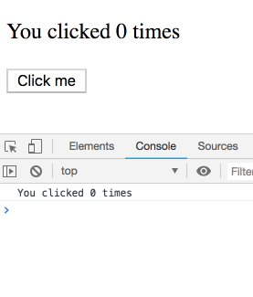

# React Hooks ——  useEffect 由浅入深🔥🔥🔥

本文会带你由浅入深系统的学习下 `useEffect` 钩子的使用。通过本文，你可以学会：如何使用 `useEffect`、`Effects` 的生命周期、如何进行 `effct` 与 事件函数的分离、如何移除不必要的 `useEffect`、如何移除不必要的依赖。相信通过学习本文，可以让你在实际开发中避免很多坑。另外本篇并不会深入到源码部分进行分享。

## 如何写一个 `Effect`

下面用一段控制视频播放与暂停的组件实现过程进行演示。

### 第一步：在 `useEffect` 钩子中声明 `Effect`

`VideoPlayer` 组件：

```jsx
function VideoPlayer({ src, isPlaying }) {
  // TODO: 我们希望在这里通过 isPlaying 属性去控制视频的播放或者暂停
  return <video src={src} />;
}
```

在 `VideoPlayer` 组件中，我们期望通过 `isPlaying` 属性去控制视频的播放或者暂停。

然而 `HTML` 的 `video` 标签并没有  `isPlaying` 属性，如果想控制视频播放效果，只能通过调用 `video` `DOM` 对象的 `play()` & `pause()` 方法实现。既然如此，那我们可能会通过判断 `isPlaying` 属性去调用 `play()` 或 `pause()` 方法。

为此我们需要通过 `useRef` 钩子获取 `video` 节点，并判断`isPlaying`属性去执行方法。

```jsx
import { useState, useRef, useEffect } from 'react';

function VideoPlayer({ src, isPlaying }) {
  // 声明 ref 变量
  const ref = useRef(null);
	
  // 通过判断 isPlaying 属性去调用 play() 或 pause() 方法
  if (isPlaying) {
    ref.current.play();
  } else {
    ref.current.pause(); 
  }

  return <video ref={ref} src={src} loop playsInline />;
}

export default function App() {
  const [isPlaying, setIsPlaying] = useState(false);
  return (
    <>
      <button onClick={() => setIsPlaying(!isPlaying)}>
        {isPlaying ? 'Pause' : 'Play'}
      </button>
      <VideoPlayer
        isPlaying={isPlaying}
        src="https://interactive-examples.mdn.mozilla.net/media/cc0-videos/flower.mp4"
      />
    </>
  );
}

```

然而执行上面的代码，你会发现报错。

这是因为我们在**函数组件顶层**使用了 `ref` 去操作 `DOM` 方法，这在 `React` 中是不允许的。在 `React` 中，渲染阶段计算返回的 `JSX` 必须是纯操作，整个渲染阶段的计算过程不能有副作用，比如操作 `DOM`。 

为了解决这个问题，我们应该将带有副作用的操作：执行 `DOM` 方法，放在 `useEffect` 钩子中。

```jsx
import { useState, useRef, useEffect } from 'react';

function VideoPlayer({ src, isPlaying }) {
  // ...
  // 在 useEffect 钩子中声明副作用代码
  useEffect(() => {
    if (isPlaying) {
      ref.current.play();
    } else {
      ref.current.pause();
    }
  });

  // ...
}
```

`完成上面代码`，你会发现组件已经可以正常渲染。点击 `Play` 按钮可以控制视频的播放暂停。

但是需要说明的是，每次 `VideoPlayer` 组件渲染的时候，`React` 会更新视图，然后再执行 `useEffect` 钩子中的代码。换句话说就是：**`React` 将 `useEffect` 中的代码延迟到了视图渲染完成之后执行**。

也就是说，当 `App` 组件被渲染或更新到视图上时，发生了下面的操作：

1. 首先 `React` 确保绑定了指定属性的 `video` 渲染到视图上
2. 然后 `React` 会执行 `useEffect` 中带有副作用的代码
3. 最终，副作用代码会根据 `isPlaying` 属性执行 `play()` 或 `pause()`  方法。

### 第二步：根据 `Effects` 来指定数组依赖项

默认情况下，每次组件渲染后都会执行 `useEffect` 钩子中的代码。但是有时候你并不想这么做，因为：

- 有时频繁执行副作用代码，会导致应用性能变差，渲染变慢。
  - 比如说你在副作用进行的是链接服务器操作，但是只想建立一次链接，因为频繁链接会消耗流量，影响性能
- 有时频繁执行会造成不符合预期情况的效果。
  - 比如你想做一个渐隐的动画效果，但需要仅当组件第一次出现时触发下。因为重复的动画效果会影响用户操作体验。

为了演示这个问题，改变下上面的示例：

```jsx
import { useState, useRef, useEffect } from 'react';

function VideoPlayer({ src, isPlaying }) {
  const ref = useRef(null);

  useEffect(() => {
    if (isPlaying) {
      console.log('Calling video.play()'); // 输出日志
      ref.current.play();
    } else {
      console.log('Calling video.pause()'); // 输出日志
      ref.current.pause();
    }
  });

  return <video ref={ref} src={src} loop playsInline />;
}

export default function App() {
  const [isPlaying, setIsPlaying] = useState(false);
  const [text, setText] = useState('');
  
  return (
    <>
    	{/* 更新父组件的状态 */}
      <input value={text} onChange={e => setText(e.target.value)} />

      <button onClick={() => setIsPlaying(!isPlaying)}>
        {isPlaying ? 'Pause' : 'Play'}
      </button>
      <VideoPlayer
        isPlaying={isPlaying}
        src="https://interactive-examples.mdn.mozilla.net/media/cc0-videos/flower.mp4"
      />
    </>
  );
}

```

- 在父组件中添加了一个输入框，用于更新父组件的 `text` 状态
- 在子组件的 `Effect` 中添加了 `console.log` ，用于观察副作用是否被执行

当你在父组件的输入框中输入文本时，会注意输入会导致子组件的 `Effect` 重新运行。而我们期望的是 `App` 无关状态的改变并不会影响到 `VideoPlayer` 组件的副作用执行。

这时，你可以通过给 `useEffect` 钩子传递第二个参数：依赖数组，作为参数。以告诉 `React` 跳过不必要的 `Effect` 执行。

```jsx
function VideoPlayer({ src, isPlaying }) {
 	// ...

  useEffect(() => {
    // ...
  }, []);

  // ...
}
```

如果你有使用 `eslint-plugin-react-hooks` 插件的话，会看到页面提示 `useEffect` 出现依赖丢失的提示信息。

这表明你需要在数组中添加 `Effect` 中使用到的依赖项：

```jsx
  useEffect(() => {
    if (isPlaying) { // It's used here...
      // ...
    } else {
      // ...
    }
  }, [isPlaying]); // ...so it must be declared here!
```

添加依赖项，就是告诉 **`React` 只有数组中的依赖项发生变化的时候才去执行 `Effect`，开始状态同步。**现在在 `input` 标签中输入内容，就不会看到控制台有日志输出了。

> 依赖数组中可以包含多个依赖项，只要依赖数组有一项状态发生改变，不同与上一次的渲染，则 `React` 就会重新渲染。`React` 内部会使用 `Object.is` API 对依赖项进行比较，然后判断是否需要进行停止同步或重新开始同步。

### 第三步：`Effects` 可以返回一个 `cleanup` 函数

被 `useEffect` 钩子包裹的 `Effects` 代码可以返回一个函数，这个函数通常将其称为`cleanup` 函数，**这个函数会在当前 `Effect` 的依赖发生更新或者组件被卸载的时候被执行，主要职责在于停止同步状态。**

有以下应用场景：

- 清除计时器

```jsx
function IntervalCom() {
 	// ...

  useEffect(() => {
    // ...
    const timer = setInterval(() => {
      // 做一些事情
    })
    return () => {
			clearInterval(timer)
    }
  }, []);

  // ...
}
```

- 重置 `Flag` 

```jsx
let flag = true
function MyComponent() {
 	// ...
  useEffect(() => {
    // ...
    if(flag) {
			// 做一些事情...
      flag = false
    }
    return () => {
			flag = true
    }
  }, []);

  // ...
}
```

- 监听事件

```jsx
function MyComponent() {
  
  useEffect(() => {
    function handleScroll(e) {
      console.log(e.clientX, e.clientY);
    }
    window.addEventListener('scroll', handleScroll);
    
    return () => window.removeEventListener('scroll', handleScroll);
  }, []);
  // ...
}

```

从上面几个场景，可以看出，`Effect` 中 **`cleanup` 函数主要职责在于停止当前 `Effect`**。

> 另外 `React` `18` 之后，默认在开发模式下，会在组件初始化的时候， `React` 会执行两次 `Effect`，主要是为了验证你的 `Effect` 写的是否规范，符合预期。

### 响应式的 `Effects` 的特点

通常 `React` 组件内部有两种类型的逻辑代码块：

- **渲染期间执行的代码(主要负责描述 `UI`)会一直存在于你的组件顶层**。
  - 这部分代码在 `React` 每次调用你的函数组件时都会被执行。
  - 在函数组件顶层你可以获取到 `props` 、`state`，并对其进行一些计算转换等操作，并且返回视图所需渲染的 `JSX` 结构。
  - 顶层代码必须是纯函数。像一个数学方程式，仅负责计算结果，而不做其他任何事情。
- **事件处理函数(主要负责交互或进行一些逻辑判断)是组件内的嵌套函数**。
  - 这部分代码一般需要通过用户的交互操作执行，比如输入、点击、滚动、拖动等等。
  - 它们主要负责执行交互任务。事件函数可以更新字段、发起 `HTTP` 请求、进行页面导航。
  - 这些逻辑通常会包含**副作用（因为他们影响到组件的状态），**通常由用户的交互行为所触发。

而造成这种变化的行为，我们称为 **副作用**。

**`Effects` 可以让你声明由渲染过程自然引起的副作用，而不是事件函数引起的副作用。**

例如在 `ChatRoom` 组件中发送一条信息是一个事件，因为它是由用户具体的点击操作引起的。

而与服务器建立链接是一个 `effect`，因为它是由于 `ChatRoom` 组件从创建到被渲染至视图的过程而自然引发的一个事件。因为只要组件出现在视图上就需要与服务器建立连接，而不是由用户的哪个交互操作触发的。

`Effects` 在视图更新结束后的渲染进程结束时运行，这对于同步 `React` 组件与外部系统是非常好的时机。

不要急于在组件中添加 `Effects` 。请记住，`Effects` 通常用于“跳出” `React` 代码，并与一些外部系统同步。这包括浏览器 `api`、第三方小部件、网络等等。如果你的 `Effect` 仅根据其他状态调整某些状态，则可能不需要 `Effect`。

#### 每次渲染的 `Effect` 都是独立的

我们以下面的 `Counter` 组件为例，在你尝试 `3s` 内快速点击 `button` 的时候，控制台会输出什么？

```jsx
function Counter() {
  const [count, setCount] = useState(0);

  useEffect(() => {
    setTimeout(() => {
      console.log(`You clicked ${count} times`);
    }, 3000);
  }, [count]);

  return (
    <div>
      <p>You clicked {count} times</p>
      <button onClick={() => setCount(count + 1)}>
        Click me
      </button>
    </div>
  );
}
```

如果你在 `3s` 内快速的点击 5 次，最终 `3s` 后控制台输出是哪一个：

- 情况一：只输出一次，最终一次打印 5。
- 情况二：打印五次 `5`。
- 情况三：依次打印 `1、2、3、4、5`。

真实的情况是：



上面的情况说明：在每次 `count` 发生更新后，都有一个与之在当前渲染中对应的 `Effect` 函数去执行同步逻辑。也就是说每一个不同状态的 `count` 都有一个对应的 `effect` 去执行同步 ——  ***`effect`  函数本身*在每一次渲染中都不相同。**

每一个不同渲染状态的`effect`看到的`count`值都来自于它属于的那次渲染：

```jsx
 // During first render
function Counter() {
  // ...
  useEffect(
    // Effect function from first render
    setTimeout(() => {
      document.title = `You clicked ${0} times`;
    }, 3000);
  );
  // ...
}

// After a click, our function is called again
function Counter() {
  // ...
  useEffect(
    // Effect function from second render
    setTimeout(() => {
      document.title = `You clicked ${1} times`;
    }, 3000);
  );
  // ...
}

// After another click, our function is called again
function Counter() {
  // ...
  useEffect(
    // Effect function from third render
    setTimeout(() => {
      document.title = `You clicked ${2} times`;
    }, 3000);
  );
  // ..
}
```

`React` 会记住你提供的 `effect` 函数，并且会在每次更改更新至 `DOM` 并让浏览器绘制屏幕后去调用它。

所以虽然我们说的是一个 *`effect`*，但其实每次渲染都是一个*不同的函数* — 并且每个 `effect` 函数“看到”的`props`和`state`都来自于它属于的那次特定渲染。

**概念上，你可以想象`effects`是渲染结果的一部分。**

> 大白话理解
>
> 函数组件的更新执行每次都会创建一个不同的 `effect` 用于去负责同步与之对应的任务。

#### `useEffect` 需要根据依赖项的变化进行同步 & 停止同步

设想一个 `ChatRoom` 组件，可以接受一个 `roomId` 的 `props`，它由用户通过点击父组件下拉框产生，并传递给 `ChatRoom` 组件。我们假设初始时用户选择的是 “`general`” 作为 `roomId`。`app` 显示 “`general`” 聊天室：

```jsx
const serverUrl = 'https://localhost:1234';

function ChatRoom({ roomId }) {
  useEffect(() => {
    const connection = createConnection(serverUrl, roomId);
    connection.connect();
    return () => {
      connection.disconnect();
    };
  }, [roomId]);
  return <h1>Welcome to the {roomId} room!</h1>;
}
```

在页面被渲染后，`React` 会运行 `Effect` 进行状态同步。链接 “`general`” 房间：

```jsx
function ChatRoom({ roomId /* "general" */ }) {
  useEffect(() => {
    console.log('connection', roomId)
    const connection = createConnection(serverUrl, roomId); // Connects to the "general" room
    connection.connect();
    return () => {
      console.log('cleanup', roomId)
      connection.disconnect(); // Disconnects from the "general" room
    };
  }, [roomId]);
  // ...
```

到目前为止，一切都表现的符合预期。

之后，用户在下拉框中选择了另一个聊天室：“`travel`”。这意味着我们需要断开  “`general`”  的拦截，并与 “`travel`”聊天室重新建立链接。

```jsx
function ChatRoom({ roomId /* "travel" */ }) {
  // ...
  return <h1>Welcome to the {roomId} room!</h1>;
}
```

切换后发生了:

- `React` 首先会更新 `UI`，用户看到新的视图。
- `useEffect` 对比依赖项 `roomId`，判断出已经发生变化。
- 执行 cleanup 函数，停止与旧的 `roomId` 断开链接，停止状态同步(断开与 “`general`” 房间的连接)
- 开始与新的 `roomId` 建立链接，进行状态同步(连接到“`travel`”房间)

这就是说 `useEffect` 中的代码会根据需要被多次执行。并且每次执行之前，会运行先前 `Effect` 返回的 `cleanup` 函数。

#### 每个 `useEffect` 的任务都是独立

不要向一个已经存在 `Effect` 中添加不相关的代码逻辑，因为这些代码会与所在的 `Effect` 同时运行。

例如，假设你想在用户访问时发送一个分析事件。组件中已经存在了一个依赖于 `roomId` 的 `Effect`，所以你可能会想在这里添加新的需求:

```jsx
function ChatRoom({ roomId }) {
  useEffect(() => {
    logVisit(); // 发送分析日志
    const connection = createConnection(serverUrl, roomId);
    connection.connect();
    return () => {
      connection.disconnect();
    };
  }, [roomId]);
  // ...
}
```

假设稍后 `roomId` 发生变化，或者需要向这个 `Effect` 添加一个新的依赖项，则当前 `Effect` 需要重新建立连接。如果此 `Effect` 重新同步，则会重复调用 `logVisit()`。但你仅想在组件初始化的时候调用一次。

由于 `logVisit()` 与建立连接是两个独立的事情，所以它们应该被写成两个独立的 `Effect`:

```jsx
function ChatRoom({ roomId }) {
  useEffect(() => {
    logVisit();
  }, []);

  useEffect(() => {
    const connection = createConnection(serverUrl, roomId);
    // ...
  }, [roomId]);
  // ...
}
```

**代码中的每个 `Effect` 都应该代表一个独立的同步过程。**两个 `Effect` 互不干扰。

在上面的例子中，删除一个 `Effect` 不会破坏另一个 `Effect` 的逻辑。这意味着它们负责同步不同的内容，因此将它们分开是合理的。

#### `Effects` 只会响应为响应式(参与了渲染数据流的数据)的状态

下面这段代码中，`Effect` 读取两个变量( `serverUrl` 和 `roomId` )，但只指定了 `roomId` 作为依赖:

```jsx
const serverUrl = 'https://localhost:1234';

function ChatRoom({ roomId }) {
  useEffect(() => {
    const connection = createConnection(serverUrl, roomId);
    connection.connect();
    return () => {
      connection.disconnect();
    };
  }, [roomId]);
  // ...
}
```

为什么不需要将 `serverUrl` 设置为依赖项？

这是因为 `serverUrl` 不会因为重新渲染而改变。无论组件重新渲染多少次，用什么 `props` 和 `state`，都是一样的。因为 `serverUrl` 从不改变，所以将它指定为依赖项是没有意义的。毕竟，依赖关系只有在随时间变化时才会做一些事情!

另一方面，在重新渲染时，`roomId` 可能是不同的。**在组件中声明的 `props`、`state` 和其他值是响应式的，因为它们是在渲染期间通过计算得到的，并参与了 `React` 数据流。**

如果 `serverUrl` 是一个状态变量，它将是响应式的。则响应值必须包含在依赖项中:

```jsx
function ChatRoom({ roomId }) { // Props change over time
  const [serverUrl, setServerUrl] = useState('https://localhost:1234'); // State may change over time

  useEffect(() => {
    const connection = createConnection(serverUrl, roomId); // Your Effect reads props and state
    connection.connect();
    return () => {
      connection.disconnect();
    };
  }, [roomId, serverUrl]); // So you tell React that this Effect "depends on" on props and state
  // ...
}
```

通过将 `serverUrl` 包含为依赖项，可以确保 `Effect` 在 `serverUrl` 更改后重新同步。

更改所选聊天室或在此沙箱中的服务器`URL`:

`App.js` 组件

```jsx
import { useState, useEffect } from 'react';
import { createConnection } from './chat.js';

function ChatRoom({ roomId }) {
  const [serverUrl, setServerUrl] = useState('https://localhost:1234');

  useEffect(() => {
    const connection = createConnection(serverUrl, roomId);
    connection.connect();
    return () => connection.disconnect();
  }, [roomId, serverUrl]);

  return (
    <>
      <label>
        Server URL:{' '}
        <input
          value={serverUrl}
          onChange={e => setServerUrl(e.target.value)}
        />
      </label>
      <h1>Welcome to the {roomId} room!</h1>
    </>
  );
}

export default function App() {
  const [roomId, setRoomId] = useState('general');
  return (
    <>
      <label>
        Choose the chat room:{' '}
        <select
          value={roomId}
          onChange={e => setRoomId(e.target.value)}
        >
          <option value="general">general</option>
          <option value="travel">travel</option>
          <option value="music">music</option>
        </select>
      </label>
      <hr />
      <ChatRoom roomId={roomId} />
    </>
  );
}
```

chat.js

```jsx
export function createConnection(serverUrl, roomId) {
  // A real implementation would actually connect to the server
  return {
    connect() {
      console.log('✅ Connecting to "' + roomId + '" room at ' + serverUrl + '...');
    },
    disconnect() {
      console.log('❌ Disconnected from "' + roomId + '" room at ' + serverUrl);
    }
  };
}
```

每当你更改响应值(如 `roomId` 或 `serverUrl` )时，`Effect` 就会重新连接到聊天服务器。

> **注意**
>
> **组件内部的所有值(包括组件主体中的 `props` 、`state` 和变量)、或者基于`props` 、`state`计算出的值都是响应式的。任何响应值都可以在重新渲染时发生变化，因此需要将 `Effect` 中使用到的所有响应式的状态添加到 `Effect` 的依赖项数组中。**

###  `useEffect` 使用场景

- 请求服务端数据

```jsx
useEffect(() => {
  let ignore = false;

  async function startFetching() {
    const json = await fetchTodos(userId);
    if (!ignore) {
      setTodos(json);
    }
  }

  startFetching();

  return () => {
    ignore = true;
  };
}, [userId]);
```

注意 `useEffect` 接受的 `Effect` 函数不能是异步的。如果需要进行异步请求，必须在其内部进行一层包裹。

- 触发动画

```js
useEffect(() => {
  const node = ref.current;
  node.style.opacity = 1; // Trigger the animation
  return () => {
    node.style.opacity = 0; // Reset to the initial value
  };
}, []);
```

- 进行埋点

```js
useEffect(() => {
  trackEvent(param); // Sends a track request
}, [param]);
```

- 操作一些第三方库，比如地图、对话框、`JQuery` 等等

```jsx
useEffect(() => {
  const map = mapRef.current;
  map.setZoomLevel(zoomLevel);
}, [zoomLevel]);
```

### 避免无限循环

我们前面说过，如果在 `useEffect` 中使用了某些 `state` 时，必须在其依赖数组中进行声明。那么你可能会遇到这种情况：

1. 在 `Effect` 中更新依赖项：

```jsx
function MyComponent() {
  const [state, setState] = useState({
    //...
  })
  useEffect(() => {
    // 在这里你可能会进行一些异步操作，然后更新 state
    setState({
      ...state,
      ...otherState
    })
  }, [state]);
  // ...
}
```

2. 在没有添加依赖项数组的情况下，更新了组件内部状态：

```jsx
function MyComponent() {
  const [state, setState] = useState({
    //...
  })
  useEffect(() => {
    // 直接更新 state
    fetch().then(res=> {
			setState({
        ...res.data
      })
    })
  });
  // ...
}
```

上面这两种情况会导致陷入无限循环的过程中。这是因为：

- `useEffect` 会在视图渲染后执行，当组件已经渲染到视图后，由于 `useEffect` 中进行了状态更新的操作
- 会导致组件进入下一轮的循环过程：`render` → `commit` → `painting` → `render` → `commit` ...
- 如此往复，就陷入死循环

如果遇到这个问题，那你需要考虑下，`useEffect` 中的代码真的有必要放在 `useEffect` 钩子中吗？是不是忘添加依赖项了？`Effect` 中的逻辑能不能放在事件函数中？还有其他解决方式吗？

### 使用 `useLayoutEffect` 在渲染前执行副作用

前面说到 `useEffect` 中的副作用代码会在渲染后执行，那如果想在渲染前执行一些副作用怎么操作？

这里 `React` 为用户提供了一个 `useLayoutEffect` 钩子，`useLayoutEffect` 钩子包裹的副作用会在浏览器渲染之前执行我们看一段代码，进行对比下：

`useEffect`：

```jsx
function App() {
  const [count, setCount] = useState(0);
  
  useEffect(() => {
    if (count === 0) {
      const randomNum = 10 + Math.random()*200
      setCount(10 + Math.random()*200);
    }
  }, [count]);

  return (
      <div onClick={() => setCount(0)}>{count}</div>
  );
}
```


运行上面代码，进行点击。你会发现数字更新的过程中会有抖动闪烁的情况出现。原因在于，当你每次点击 `div`， `count` 会更新为 0， 之后 `useEffect` 内又把 `count` 改为一串随机数。所以页面会先渲染成 `0`，然后再渲染成随机数，由于更新很快，所以出现了闪烁。

使用 `useLayoutEffect`：

```jsx
function App() {
  const [count, setCount] = useState(0);
  
  useLayoutEffect(() => {
    if (count === 0) {
      const randomNum = 10 + Math.random()*200
      setCount(10 + Math.random()*200);
    }
  }, [count]);

  return (
      <div onClick={() => setCount(0)}>{count}</div>
  );
}
```


使用 `useLayoutEffect` 后再点击数字，你会发现抖动闪烁的效果消失了。这时因为 `useLayoutEffect` 在渲染前执行，所以在将数字渲染到页面的时候，会以最后一次更新的值为准。

**注意**

由于 `useLayoutEffect` 中的副作用会在渲染前执行，所以不是做一些耗时的操作，否则会阻塞渲染，请谨慎使用。

###  `Effects`与事件处理函数有何不同之处？

再讲不同之前，我们先说说事件处理函数。这里我们可以继续拿计数器组件说下：

```jsx
function Counter() {
  const [count, setCount] = useState(0);

  function handleAlertClick() {
    setTimeout(() => {
      alert('You clicked on: ' + count);
    }, 3000);
  }

  return (
    <div>
      <p>You clicked {count} times</p>
      <button onClick={() => setCount(count + 1)}>
        Click me
      </button>
      <button onClick={handleAlertClick}>
        Show alert
      </button>
    </div>
  );
}
```

如果按照下面的步骤去操作：

- 进行点击，增加 `counter` 到 3
- 点击一下 “`Show alert`”
- 继续点击，增加 `counter` 到 `5` 并且在定时器回调触发前完成

 `alert` 会弹出什么呢？

- 会是 5 吗？这个值是 `alert` 的时候 `counter` 的实时状态。

- 或者会是 3 吗？这个值是点击 `show alert` 时候的状态。

答案是 3 ，这是因为 `alert` 会“捕获”点击按钮时候的 `counter` 状态。这与 `effect` 一样。每一次渲染都有一个“新版本”的`handleAlertClick` 事件函数。每一个版本的`handleAlertClick` 只能使用当前渲染版本状态中的 `count`：

```jsx
// During first render
function Counter() {
  // ...
  function handleAlertClick() {
    setTimeout(() => {
      alert('You clicked on: ' + 0);
    }, 3000);
  }
  // ...
  <button onClick={handleAlertClick} /> // The one with 0 inside
  // ...
}

// After a click, our function is called again
function Counter() {
  // ...
  function handleAlertClick() {
    setTimeout(() => {
      alert('You clicked on: ' + 1);
    }, 3000);
  }
  // ...
  <button onClick={handleAlertClick} /> // The one with 1 inside
  // ...
}

// After another click, our function is called again
function Counter() {
  // ...
  function handleAlertClick() {
    setTimeout(() => {
      alert('You clicked on: ' + 2);
    }, 3000);
  }
  // ...
  <button onClick={handleAlertClick} /> // The one with 2 inside
  // ...
}
```

也就是说，事件处理函数“属于”某一次特定的渲染，当你点击的时候，它会使用那次渲染中`counter`的状态值。

结合我们在 [React Hooks —— 状态管理篇](https://juejin.cn/post/7170521701162156046) 中所了解到：在任意一次渲染中，`props` 和 `state` 是始终保持不变的。如果 `props` 和 `state` 在不同的渲染中是相互独立的，那么使用到它们的任何值也是独立的（包括事件处理函数、`effects`）。它们都“属于”一次特定的渲染。即便是事件处理中的异步函数调用“看到”的也是这次渲染中的`count`值。

> 提示
>
> 这里说到了每一次的渲染都会有一个不同的事件处理函数。试想一下如果当前的事件是作为 `props` 传递的。那意味着：事件处理函数会影响到子组件的每一次渲染——子组件会对比 `props`，如果 `props` 发生变化就会更新渲染。但如果 `props` 是函数，就没有必要每次进行渲染，仅需等到函数所依赖的状态发生变化的时候，再重新渲染。React 为了解决这个问题，引入了 [`useCallback`](https://beta.reactjs.org/apis/react/useCallback#usecallback) 钩子。用于解决函数缓存的问题。

由此可以看出，事件处理函数与 `Effects` 相同。两者所能访问的状态都是与一次具体的渲染所绑定的。

另外：

- 事件处理函数是由用户的特定交互行为所触发的，比如点击、鼠标滚动、输入等。而 `effects` 是由 `React` 的渲染过程引起的自然过程，而且需要明确声明依赖。两者可能会产生影响组件状态的副作用。
- 事件处理函数可以通过 `props` 做为回调函数向下传递，来实现由下向上的组件通信。但是 `effects` 不可以。

### `useState` & `useEffect` 一起使用

下面的例子可以让你通过实践来感受下使用状态的 `Effect` 是如何工作的。

代码会在 `Effect` 运行一个计时器， `setTimeout` 在三秒后调用 `console` 去打印 `input` 中的文本。`cleanup` 函数会取消 `timeoutId`，点击 `Mount the component` 开始。

`Playground` 组件：通过在 `setTimeout` 中打印日志，来观察 `Effect` 的执行情况

```jsx
import { useState, useEffect } from 'react';

function Playground() {
  const [text, setText] = useState('a');

  useEffect(() => {
    function onTimeout() {
      console.log('⏰ ' + text);
    }

    console.log('🔵 Schedule "' + text + '" log');
    const timeoutId = setTimeout(onTimeout, 3000);

    return () => {
      console.log('🟡 Cancel "' + text + '" log');
      clearTimeout(timeoutId);
    };
  }, [text]);

  return (
    <>
      <label>
        What to log:{' '}
        <input
          value={text}
          onChange={e => setText(e.target.value)}
        />
      </label>
      <h1>{text}</h1>
    </>
  );
}
```

`App` 组件：用于控制挂载或卸载 `Playground` 组件

```jsx
import { useState } from 'react';

export default function App() {
  const [show, setShow] = useState(false);
  return (
    <>
      <button onClick={() => setShow(!show)}>
        {show ? 'Unmount' : 'Mount'} the component
      </button>
      {show && <hr />}
      {show && <Playground />}
    </>
  );
}

```

- 首先你会看到控制台输出了：`Schedule “a” log`→`Cancel “a” log`→`Schedule “a” log`，三秒之后输出 `“a”`
- 这时因为第一次打印的 `Schedule “a” log`→`Cancel “a” log` 是为了 `React` 在开发环境中验证你的 `Effects` 是否符合规范。
- 现在在 `input` 中输入 `abc`。如果你做的足够快，你会看到 `Schedule “ab” log` 紧接着是 `Cancel “ab” log` 和 `Schedule “abc” log`。
- 这是因为 **`React` 总是会在执行下一次渲染的 `Effect` 之前，先执行 `cleanup` 函数清除上一次渲染的 `Effect`。**
- 这就是为什么即使你在 `input` 标签中快速输入，每次最多只调度一次 `setTimeout` 。编辑输入几次，观察控制台，感受一下 `Effects` 是如何被清理的。
- 然后你再输入一些内容，并且立即点击 `“Unmount the component”`。
- 你会注意到 `cleanup` 函数会清理最后一次渲染的 `Effect`。
- 最后，你可以尝试编辑上面的组件，注释掉 `cleanup` 函数，此时`timeout` 不会被取消。
- 然后尝试快速的输入 `abcde`。你猜在三秒后发生什么？在 `timeout` 中的 `console` 是否会只打印五次 `abcde` 吗？
- 实际上，在三秒之后你会看到控制台输出了 logs (`a`, `ab`, `abc`, `abcd`, and `abcde`)，而不是五次 `abcde`。
- 就像前面提到的：**每个 `Effect` 都会从与之对应的渲染中获取文本值。**
- 文本状态的改变并不重要：一个带有 `text = ab` 状态渲染中 `Effect`，所能获取的只能是 `text = ab`。
- 换句话说 **每次渲染的 `Effect` 是相互隔离的。**

---

### 总结：

- 不像事件函数，`Effect`的执行是由渲染事件本身自然引起的而不是有一个特定的交互行为引起的。
- `Effect` 可以让你的组件与外部系统进行同步操作
- 默认情况下，`Effect` 会在每次渲染之后运行
- 如果 `Effect` 所有的依赖值在两次渲染之间没有变换，则`React` 不会执行 `Effect`
- 你不能选择你的依赖，依赖是由 `Effect` 中的代码确定的
- 一个空的依赖数组对应于组件的 `mount` 阶段。也就是初次渲染到视图的时候
- 当开发环境中，`React` 会 `mount` 两次组件，已验证你的 `Effect` 是否符合规范，
-  `Effect `可以返回一个 `cleanup` 函数，这个函数会在组件卸载的时候执行

## 响应式的 `Effects` 的生命周期

`Effects` 的生命周期与组件不同。组件可以挂载、更新或卸载。而一个 `Effect` 只能做两件事：开始同步副作用，停止同步副作用。如果你的 `Effect` 依赖于随时可能发生变化的 `props` 和 `state`，那么这个循环可能会发生多次。`React` 提供了一个 `linter` 插件来检查是否正确指定了`Effect` 的依赖项。以确保你的 `Effect` 与最新的 `props` 和 `state` 保持同步。

### 一个 `Effect` 的生命周期

每个 `React` 组件都会经历相同的生命周期：

- 挂载：将组件渲染到视图上
- 更新：当组件接受新的 `props` 或者 `state` 时，进行更新操作。通常是为了响应交互事件
- 卸载：当组件从视图上移除时

一个组件基本都会经历上面三个过程，但是 `Effect` 与此不同。在使用 `Effect` 的过程中，不要把组件的生命周期与 `Effect` 的生命周期混为一谈。请独立的思考每个 `Effect` 在你组件中的生命周期。`Effect` 通常用于描述如何将当前的 `props` 或 `state `状态同步到外部系统。随着代码的变化，这种同步操作需要或多或少的发生。

为了说明这一点，设想下将组件连接到聊天服务器的效果:

```jsx
const serverUrl = 'https://localhost:1234';

function ChatRoom({ roomId }) {
  useEffect(() => {
    const connection = createConnection(serverUrl, roomId);
    connection.connect();
    return () => {
      connection.disconnect();
    };
  }, [roomId]);
  // ...
}
```

 `Effect` 的主体部分明确如何**开始同步状态**：

```jsx
    // ...
    const connection = createConnection(serverUrl, roomId);
    connection.connect();
    return () => {
      connection.disconnect();
    };
    // ...
```

通过 `Effect` 返回的 `cleanup` 函数明确如何**停止同步状态**：

```jsx
    // ...
    const connection = createConnection(serverUrl, roomId);
    connection.connect();
    return () => {
      connection.disconnect();
    };
    // ...
```

凭直觉，你可能认为 `React` 会在组件挂载时开始同步，在组件卸载时停止同步。然而，实际并不是这样的！有时，还可能需要在组件保持挂载的情况下进行**多次开始和停止同步**。

接下来让我们一起看看为什么这是必要的，它何时发生，以及如何控制这种行为。

> 注意
>
>
> 有时你的 `Effect` 不会返回 `cleanup` 函数。通常情况下，你认为需要返回，但是如果你没有返回的情况下，`React` 的表现行为就像你返回了一个什么都不做的空的 `cleanup` 函数。

### 从 `Effect` 的角度思考

让我们从 `CharRoom` 组件的角度来回顾一下发生的一切:

- `CharRoom` 挂载时 `roomId` 设置为 “`general`”
- `roomId` 设置为 “`travel`”，`CharRoom` 更新
- `roomId` 设置为“`music`”，`CharRoom` 更新
- 切换视图，`CharRoom` 卸载

在组件生命周期的每一个点上，你的 `Effect` 做了不同的事情:

- `Effect` 连接到 “`general`” 房间
- `Effect` 与 “`general`” 房间断开连接，与 “`general`” 房间连接
- `Effect` 从 “`travel`” 房间断开，连接到 “`music`” 房间
- `Effect` 与 “`music`” 室断开连接

现在让我们从 `Effect` 本身的角度来思考发生了什么:

```jsx
  useEffect(() => {
    // Effect 链接到指定的 roomId
    const connection = createConnection(serverUrl, roomId);
    connection.connect();
    return () => {
      // ...断开连接
      connection.disconnect();
    };
  }, [roomId]);
```

这段代码的结构可能会启发你， 这一系列操作发生了什么事情:

- `Effect` 连接到 “`general`” 房间(`roomId` 变化时断开链接)
- `Effect` 连接到 “`travel`” 房间(`roomId` 变化时断开链接)
- `Effect` 连接到 “`music`” 房间(`roomId` 变化时断开链接)

以前，你是从组件的角度考虑问题的。当你从组件的角度看时，很容易把 `Effects` 看作是在特定时间触发的“回调”或“生命周期事件”，比如“渲染之后”或“卸载之前”。这种思维方式会把事情变得复杂，所以最好避免。

**相反，每次只关注单个的启动/停止周期。无论组件是挂载、更新还是卸载，都应该如此。你所需要做的就是描述如何启动同步和如何停止同步。如果你按规则来做，你的 `Effect` 会根据需要多次启动和停止。**

这可能会启发你，在编写创建 `JSX` 的渲染逻辑时，不要考虑组件是在挂载还是在更新。你描述应该出现在屏幕上的内容，然后 `React` 来做剩下的工作。

### 给 `Effect` 一个空依赖数组意味着什么

如果你将 `serverUrl` 和 `roomId` 都移到组件之外会发生什么?

```jsx
const serverUrl = 'https://localhost:1234';
const roomId = 'general';

function ChatRoom() {
  useEffect(() => {
    const connection = createConnection(serverUrl, roomId);
    connection.connect();
    return () => {
      connection.disconnect();
    };
  }, []); // ✅ All dependencies declared
  // ...
}
```

现在 `Effect` 的代码不使用任何响应值，因此它的依赖项可以为空 `([])`。

如果从组件的角度考虑，空的 `[]` 依赖项数组意味着此 `Effect` 仅在组件挂载时连接到聊天室，仅在组件卸载时断开连接。(请记住，`React` 仍然会在开发环境中重新同步它，以便对 `Effect` 的逻辑进行测试。)

```jsx
import { useState, useEffect } from 'react';
import { createConnection } from './chat.js';

const serverUrl = 'https://localhost:1234';
const roomId = 'general';

function ChatRoom() {
  useEffect(() => {
    const connection = createConnection(serverUrl, roomId);
    connection.connect();
    return () => connection.disconnect();
  }, []); // 移除依赖项
  return <h1>Welcome to the {roomId} room!</h1>;
}

export default function App() {
  const [show, setShow] = useState(false);
  return (
    <>
      <button onClick={() => setShow(!show)}>
        {show ? 'Close chat' : 'Open chat'}
      </button>
      {show && <hr />}
      {show && <ChatRoom />}
    </>
  );
}
```

然而，如果从 `Effect` 的角度考虑，则意味着 `Effect` 没有依赖项，不会有影响其同步 & 停止同步过程的状态。重要的是，你已经指定了 `Effect` 如何开始和停止同步。如果你想让用户随时去改变 `roomId` 或 `serverUrl` (并为他们的改变做出响应)，则 `Effect` 代码不用改变，你只需要将它们添加到依赖项中。

### 当你不想重新同步时该怎么做

在前面的示例中，通过列出 `roomId` 和 `serverUrl` 作为依赖项，已经修复了 `lint` 错误。

然而，你可以向 `linter` “证明”这些值不是响应式的，也就是说，它们不会因为重新渲染而改变。例如，如果 `serverUrl` 和 `roomId` 不依赖于渲染并且总是具有相同的值，则可以将它们移到组件之外。现在它们不需要添加到依赖数组中:

```jsx
const serverUrl = 'https://localhost:1234'; // serverUrl is not reactive
const roomId = 'general'; // roomId is not reactive

function ChatRoom() {
  useEffect(() => {
    const connection = createConnection(serverUrl, roomId);
    connection.connect();
    return () => {
      connection.disconnect();
    };
  }, []); // ✅ All dependencies declared
  // ...
}
```

你也可以将它们移动到 `useEffect` 中。它们在渲染时不会被计算，所以它们不是响应式的:

```jsx
function ChatRoom() {
  useEffect(() => {
    const serverUrl = 'https://localhost:1234'; // serverUrl is not reactive
    const roomId = 'general'; // roomId is not reactive
    const connection = createConnection(serverUrl, roomId);
    connection.connect();
    return () => {
      connection.disconnect();
    };
  }, []); // ✅ All dependencies declared
  // ...
}
```

**`Effect` 是响应式的代码块**。当它们内部读取的值发生变化时，它们会重新同步。与每次交互只运行一次的事件处理程序不同，`Effects` 在需要同步时自动运行。

你不能自由“选择”依赖项。你的依赖项必须包含你在 `Effect` 中读取的每个响应值。`linter` 强制约束了这一点。有时，这可能会导致无限循环和你的 `Effect` 重新同步太频繁的问题。不要通过抑制 `linter`来解决这些问题! 下面是你可以尝试的方法:

- **检查 `Effect` 是否代表独立的同步过程**。如果你的 `Effect` 没有同步任何东西，那么它可能是不必要的。如果它同步了几个独立的任务，就把它拆分。
- **如果你想读取 `props` 或 `state` 的最新值，而不需要对其进行“响应”并重新同步 `Effect`，**你可以将 `Effect` 分为响应部分(你将保留在 `Effect` 中)和非响应部分(你将提取到事件函数中)。
- **避免依赖对象和函数作为依赖项。**如果在渲染期间创建对象和函数，然后从 `Effect` 中读取它们，那么它们在每次渲染时都是不同的。这将导致你的 `Effect` 每次都重新同步。

### 在事件处理函数与 `Effects` 之间选择

首先，让我们回顾下二者有什么不同。

假设你正在实现一个聊天室组件。你的需求如下所示:

- 组件应该自动连接到所选聊天室。
- 当你点击“发送”按钮时，它应该会发送消息到聊天。

假设你已经为它们实现了代码，但不确定将其放在哪里。应该使用事件处理程序还是 `Effects`? 每次你需要回答这个问题时，请考虑为什么需要运行这段代码。

#### 事件处理程序在响应特定交互时运行

从用户的角度来看，发送消息应该是因为点击了特定的 “Send” 按钮后发生。如果你在任何其他时间或任何其他原因发送他们的消息，用户将会非常不安全。这就是为什么发送消息应该是一个事件处理函数。事件处理函数让你处理特定的交互，比如点击:

```jsx
function ChatRoom({ roomId }) {
  const [message, setMessage] = useState('');
  // ...
  function handleSendClick() {
    sendMessage(message);
  }
  // ...
  return (
    <>
      <input value={message} onChange={e => setMessage(e.target.value)} />
      <button onClick={handleSendClick}>Send</button>;
    </>
  );
}
```

使用事件处理程序，可以确保 `sendMessage(message)` 只在用户按下按钮时运行。

#### `Effects` 在需要同步时，响应变化，自动运行

回想一下，你还需要保持组件与聊天室的连接。这些代码应该放到哪里?

运行这段代码的原因不是某种特定的交互。用户为什么或者如何导航到聊天室界面并不重要。

现在他们正在查看它并可以与它交互，组件需要保持与所选聊天服务器的连接。

即使聊天室组件是应用程序的初始界面，用户根本没有执行任何交互，你仍然需要连接。

这就是为什么它是一个 `Effect`:

```jsx
function ChatRoom({ roomId }) {
  // ...
  useEffect(() => {
    const connection = createConnection(serverUrl, roomId);
    connection.connect();
    return () => {
      connection.disconnect();
    };
  }, [roomId]);
  // ...
}
```

使用这段代码，你可以确保始终有一个到当前所选聊天服务器的活动连接，而不管用户执行了什么特定的交互。无论用户只是打开了你的应用程序，选择了一个不同的房间，还是导航到另一个屏幕和返回， 你的 `Effect` 将确保组件将保持与当前选择的房间同步，并将在必要时重新连接。

App 组件

```jsx
import { useState, useEffect } from 'react';
import { createConnection, sendMessage } from './chat.js';

const serverUrl = 'https://localhost:1234';

function ChatRoom({ roomId }) {
  const [message, setMessage] = useState('');

  useEffect(() => {
    const connection = createConnection(serverUrl, roomId);
    connection.connect();
    return () => connection.disconnect();
  }, [roomId]);

  function handleSendClick() {
    sendMessage(message);
  }

  return (
    <>
      <h1>Welcome to the {roomId} room!</h1>
      <input value={message} onChange={e => setMessage(e.target.value)} />
      <button onClick={handleSendClick}>Send</button>
    </>
  );
}

export default function App() {
  const [roomId, setRoomId] = useState('general');
  const [show, setShow] = useState(false);
  return (
    <>
      <label>
        Choose the chat room:{' '}
        <select
          value={roomId}
          onChange={e => setRoomId(e.target.value)}
        >
          <option value="general">general</option>
          <option value="travel">travel</option>
          <option value="music">music</option>
        </select>
      </label>
      <button onClick={() => setShow(!show)}>
        {show ? 'Close chat' : 'Open chat'}
      </button>
      {show && <hr />}
      {show && <ChatRoom roomId={roomId} />}
    </>
  );
}
```

chat.js

```jsx
export function sendMessage(message) {
  console.log('🔵 You sent: ' + message);
}

export function createConnection(serverUrl, roomId) {
  // A real implementation would actually connect to the server
  return {
    connect() {
      console.log('✅ Connecting to "' + roomId + '" room at ' + serverUrl + '...');
    },
    disconnect() {
      console.log('❌ Disconnected from "' + roomId + '" room at ' + serverUrl);
    }
  };
}
```

### 响应式的值和响应式的逻辑

直观地说，事件处理函数总是“手动”触发的，例如通过单击按钮。另一方面，`Effect` 是“自动的”: 它们运行和重新运行，只要它需要保持同步。

有一种更精确的方法来思考这个问题。

在组件主体中声明的 `props`、`state` 和变量称为响应值。在本例中，`serverUrl` 不是响应值，但 `roomId` 和 `message` 是。它们参与渲染数据流:

```jsx
const serverUrl = 'https://localhost:1234';

function ChatRoom({ roomId }) {
  const [message, setMessage] = useState('');

  // ...
}
```

由于重新渲染，这样的响应式值可能会发生变化。例如，用户可以编辑消息或在下拉列表中选择不同的 `roomId`。事件处理函数和 `effect` 在响应变化时是不同的:

- **事件处理函数内部的逻辑不是响应式的。**它将不会再次运行，除非用户再次执行相同的交互(例如，单击)。事件处理程序可以读取响应值，但不会对其更改“作出响应”。
- **`Effects` 内部的逻辑是响应式的**。如果 `Effect` 读取响应值，则必须将其指定为依赖项。然后，如果重新渲染导致该值发生变化，`React`将使用新值重新运行 `Effect` 的逻辑。 让我们回顾一下前面的例子来说明这种差异。

### 事件处理函数内部的逻辑不是响应式的

看一下这行代码。这种逻辑是否应该是响应式?

```js
    // ...    
    sendMessage(message);
    // ...
```

从用户的角度来看，对消息的更改并不意味着他们想要发送消息。它只意味着用户正在输入。换句话说，发送消息的逻辑不应该是被动的。它不应该仅仅因为响应值更改而再次运行。这就是为什么你需要把这个逻辑放在事件处理程序中:

```jsx
  function handleSendClick() {
    sendMessage(message);
  }
```

事件处理程序不是响应式的，因此 `sendMessage(message)` 只在用户单击 `Send` 按钮时运行。

### `Effecst` 内部的逻辑是响应式的

现在我们看下下面的代码：

```jsx
    // ...
    const connection = createConnection(serverUrl, roomId);
    connection.connect();
    // ...
```

从用户的角度来看，**对 `roomId` 的更改确实意味着他们想要连接到一个不同的房间**。换句话说，连接到房间的逻辑应该是响应式的。你希望这些代码行与响应值 `roomId` “保持一致”，并在该值不同时再次运行。这就是为什么你把这个逻辑放在 `Effect` 中:

```jsx
useEffect(() => {
    const connection = createConnection(serverUrl, roomId);
    connection.connect();
    return () => {
      connection.disconnect()
    };
  }, [roomId]);
```

`Effect` 是响应式的，因此 `roomId` 的每个不同值都会运行 `createConnection(serverUrl, roomId)` 和 `connect .connect()` 。你的 `Effect` 保持聊天连接同步到当前选定的房间。

### 从 `Effects` 中提取非响应式逻辑

当你想要将响应逻辑和非响应逻辑写在一起时，事情会变得更加棘手。

例如，假设你想在用户连接到聊天时显示一个通知。你从 `props` 中读取当前主题(暗或亮)，这样你就可以用正确的颜色显示通知:

```jsx
function ChatRoom({ roomId, theme }) {
  useEffect(() => {
    const connection = createConnection(serverUrl, roomId);
    connection.on('connected', () => {
      showNotification('Connected!', theme);
    });
    connection.connect();
    // ...
```

然而，`theme` 是一个响应值(它可以由于重新渲染而更改)，并且 `Effect` 读取的每个响应值都必须声明为它的依赖项。所以现在你必须指定 `theme` 作为 `Effect` 的依赖项:

```jsx
function ChatRoom({ roomId, theme }) {
  useEffect(() => {
    const connection = createConnection(serverUrl, roomId);
    connection.on('connected', () => {
      showNotification('Connected!', theme);
    });
    connection.connect();
    return () => {
      connection.disconnect()
    };
  }, [roomId, theme]); // ✅ All dependencies declared
  // ...
```

试这运行这个例子，看看你是否能发现这个用户体验的问题:

App.js

```jsx
import { useState, useEffect } from 'react';
import { createConnection, sendMessage } from './chat.js';
import { showNotification } from './notifications.js';

const serverUrl = 'https://localhost:1234';

function ChatRoom({ roomId, theme }) {
  useEffect(() => {
    const connection = createConnection(serverUrl, roomId);
    connection.on('connected', () => {
      showNotification('Connected!', theme);
    });
    connection.connect();
    return () => connection.disconnect();
  }, [roomId, theme]);

  return <h1>Welcome to the {roomId} room!</h1>
}

export default function App() {
  const [roomId, setRoomId] = useState('general');
  const [isDark, setIsDark] = useState(false);
  return (
    <>
      <label>
        Choose the chat room:{' '}
        <select
          value={roomId}
          onChange={e => setRoomId(e.target.value)}
        >
          <option value="general">general</option>
          <option value="travel">travel</option>
          <option value="music">music</option>
        </select>
      </label>
      <label>
        <input
          type="checkbox"
          checked={isDark}
          onChange={e => setIsDark(e.target.checked)}
        />
        Use dark theme
      </label>
      <hr />
      <ChatRoom
        roomId={roomId}
        theme={isDark ? 'dark' : 'light'}
      />
    </>
  );
}

```

Chat.js

```jsx
export function createConnection(serverUrl, roomId) {
  // A real implementation would actually connect to the server
  let connectedCallback;
  let timeout;
  return {
    connect() {
      timeout = setTimeout(() => {
        if (connectedCallback) {
          connectedCallback();
        }
      }, 100);
    },
    on(event, callback) {
      if (connectedCallback) {
        throw Error('Cannot add the handler twice.');
      }
      if (event !== 'connected') {
        throw Error('Only "connected" event is supported.');
      }
      connectedCallback = callback;
    },
    disconnect() {
      clearTimeout(timeout);
    }
  };
}
```

notification.js

```jsx
import Toastify from 'toastify-js';
import 'toastify-js/src/toastify.css';

export function showNotification(message, theme) {
  Toastify({
    text: message,
    duration: 2000,
    gravity: 'top',
    position: 'right',
    style: {
      background: theme === 'dark' ? 'black' : 'white',
      color: theme === 'dark' ? 'white' : 'black',
    },
  }).showToast();
}

```

当 `roomId` 改变时，聊天将如你所期望的那样重新连接。但是由于 `theme` 也是一个依赖项，每次你在暗主题和亮主题之间切换时，聊天也会重新连接。这可不太好!

换句话说，你不希望这一行是响应式的，即使它在一个 `Effect` (它是响应式的)中:

```js
// ...
showNotification('Connected!', theme);
// ...
```

你需要一种方法将非响应式的逻辑与周围的响应式 `Effect` 分离开来。

### 使用 `useEvent` 钩子声明一个非响应式的 `Event` 函数

使用一个叫做 `useEvent` 的特殊钩子从你的 `Effect` 中提取这个非响应式逻辑:

```jsx
import { useEffect, useEvent } from 'react';

function ChatRoom({ roomId, theme }) {
  const onConnected = useEvent(() => {
    showNotification('Connected!', theme);
  });
  // ...
```

这里，`onConnected` 被称为事件函数。它是 `Effect` 逻辑的一部分，但它的行为更像事件处理程序。它内部的逻辑不是响应式的，它总是可以“看到”你的 `props` 和 `state` 的最新值。

现在你可以在 `useEffect` 内部调用 `onConnected` `Event` 函数:

```jsx
function ChatRoom({ roomId, theme }) {
  const onConnected = useEvent(() => {
    showNotification('Connected!', theme);
  });

  useEffect(() => {
    const connection = createConnection(serverUrl, roomId);
    connection.on('connected', () => {
      onConnected();
    });
    connection.connect();
    return () => connection.disconnect();
  }, [roomId]); // ✅ All dependencies declared
  // ...
```

这就解决了问题。类似于 `useState` 返回的 `setter` 函数，所有的 `Event` 函数都是*稳定的*: **它们在重新渲染时不会改变**。它们不是响应式的，这就是为什么你可以在依赖项列表中跳过它们。

你可以认为事件函数非常类似于事件处理函数。主要区别在于：

- 事件处理程序是在响应用户交互时运行的
- 而事件函数是由你从 `Effects` 中触发的。
- 事件函数允许你“打破” `Effects` 的响应式和一些不应该是响应式的代码之间的关系链。

### 使用 `Event` 函数获取最新的 `props` 和 `state`

事件函数使你可以修复许多可能会试图抑制依赖 `linter` 的模式。

例如，假设你有一个 `Effect` 来记录页面访问:

```jsx
function Page() {
  useEffect(() => {
    logVisit();
  }, []);
  // ...
}
```

之后，向站点添加多条路由。现在，`Page` 组件接收一个带有当前路径的 `url` 属性。你想传递 `url` 作为你的 `logVisit` 调用`的`一部分，但是插件 `linter` 提示到:

```jsx
function Page({ url }) {
  useEffect(() => {
    logVisit(url);
  }, []); // 🔴 React Hook useEffect has a missing dependency: 'url'
  // ...
}
```

考虑一下你希望代码做什么？因为每个`URL`代表不同的页面，所以你希望记录对不同`URL`的单独访问。换句话说，这个 `logVisit` 调用应该会响应 `url` 的改变。这就是为什么，在这种情况下，它是有意义的遵循`linter`提示，并添加`url`作为依赖:

```jsx
function Page({ url }) {
  useEffect(() => {
    logVisit(url);
  }, [url]); // ✅ All dependencies declared
  // ...
}
```

现在让我们假设你想包含购物车中的商品数量和每次页面访问:

```jsx
function Page({ url }) {
  const { items } = useContext(ShoppingCartContext);
  const numberOfItems = items.length;

  useEffect(() => {
    logVisit(url, numberOfItems);
  }, [url]); // 🔴 React Hook useEffect has a missing dependency: 'numberOfItems'
  // ...
}
```

你在 `Effect` 中使用了`numberOfItems`，因此 `linter` 要求你将其作为依赖项添加。

但是，你不希望 `logVisit` 调用对 `numberOfItems` 产生响应。如果用户向购物车中放入了一些东西，而 `numberOfItems` 发生了变化，这并不意味着用户再次访问了该页。

换句话说，访问页面感觉类似于一个事件。你要非常准确地说出事情发生的时间。

解决方法将代码分成两部分:

```jsx
function Page({ url }) {
  const { items } = useContext(ShoppingCartContext);
  const numberOfItems = items.length;

  const onVisit = useEvent(visitedUrl => {
    logVisit(visitedUrl, numberOfItems);
  });

  useEffect(() => {
    onVisit(url);
  }, [url]); // ✅ All dependencies declared
  // ...
}
```

这里，`onVisit` 是一个 `Event` 函数。它里面的代码不是响应式的。这就是为什么你可以使用 `numberOfItems` (或任何其他响应值!)，而不必担心它会导致周围的代码在更改时重新执行。

另一方面，`Effect` 本身仍然是被动的。`Effect` 中的代码使用 `url` ，因此 `Effect` 将在每次使用不同的 `url` 重新渲染后重新运行。这将依次调用`onVisit` 事件函数。

因此，对于 `url` 的每次更改，你都将调用 `logVisit`，并且总是读取最新的 `numberOfItems`。但是，如果 `numberOfItems` 自己发生变化，这将不会导致任何代码重新运行。

### `Event` 函数的限制

目前，事件函数的使用方式非常有限:

- 只能从 `Effects` 内部调用它们。
- 永远不要将它们传递给其他组件或 `hook`。

例如，不要像这样声明和传递 `Event` 函数:

```jsx
function Timer() {
  const [count, setCount] = useState(0);

  const onTick = useEvent(() => {
    setCount(count + 1);
  });

  useTimer(onTick, 1000); // 🔴 Avoid: Passing event functions

  return <h1>{count}</h1>
}

function useTimer(callback, delay) {
  useEffect(() => {
    const id = setInterval(() => {
      callback();
    }, delay);
    return () => {
      clearInterval(id);
    };
  }, [delay, callback]); // Need to specify "callback" in dependencies
}
```

相反，你应该总是在使用事件函数的 `Effects` 旁边直接声明事件函数，这里将 `useEvent` 函数提取到 `useTimer` 中:

```jsx
function Timer() {
  const [count, setCount] = useState(0);
  useTimer(() => {
    setCount(count + 1);
  }, 1000);
  return <h1>{count}</h1>
}

function useTimer(callback, delay) {
  const onTick = useEvent(() => {
    callback();
  });

  useEffect(() => {
    const id = setInterval(() => {
      onTick(); // ✅ Good: Only called locally inside an Effect
    }, delay);
    return () => {
      clearInterval(id);
    };
  }, [delay]); // No need to specify "onTick" (an Event function) as a dependency
}
```

在未来，`useEvent` 这些限制可能会被取消。但是现在，你可以认为事件函数是你的 `Effect` 代码的非响应式“片段”，所以它们应该接近使用它们的 `Effect`。

### 回顾

- 事件处理程序在响应特定交互时运行。
- 效果在需要同步时运行。
- 事件处理程序内部的逻辑不是响应式的。
- `Effects` 内部的逻辑是响应式的。
- 可以将非响应性逻辑从 `Effects` 移到 `Event` 函数中。
- 只从 `Effects` 内部调用 `Event` 函数。
- 不要将 `Event` 函数传递给其他组件或 `hook`。

- 组件可以挂载、更新和卸载。
- 每个 `Effect` 都有一个独立于周围组件的生命周期。
- 每个 `Effect` 都描述了一个可以开始和停止的独立同步过程。
- 在编写和读取 `Effect` 时，应该从每个 `Effect` 的角度(如何启动和停止同步)考虑问题，而不是从组件的角度(如何安装、更新或卸载)考虑问题。
- 在组件体中声明的值是“活性的”。
- 响应值应该重新同步效果，因为它们可以随时变化。
- `linter` 验证 `Effect` 中使用的所有响应值都指定为依赖项。
- `linter` 标记的所有错误都是合法的。总有一种方法可以在不违反规则的情况下修复代码。

事件处理函数只有在再次执行相同的交互时才会重新运行。与事件处理函数不同，如果 `Effects` 读取的某些值(如 `props` 或 `state` 变量)与上一次渲染时的值不同，则会重新同步。有时，你还需要这两种行为的混合：一个响应某些值而不响应其他值的重新运行的 `Effect`。这部分将教你如何实现。多个 `Effects` 依赖有部分相同如何处理。

## 移除不必要的 `useEffect`

通过上面的简单学习，你可能会发现在 `useEffect` 中你能做很多事情，但是这很可能导致 `useEffect` 滥用，结果就是影响到你整个应用的性能表现和可维护性。

- **不要为了渲染在 `Effect` 中更新数据。**
  - 例如，我们假设你想在渲染之前过滤一个 `list`，你或许想当 `list` 改变的时候，通过写一个 `Effect` 去更新 `state` 变量。
  - 然而这是没用的。当你更新你的组件状态的时候，`React` 会首先调用你的组件函数去计算出需要渲染到视图上的内容，然后 `React` 将发生变化的部分 `commit` 到 `DOM` 上，更新视图，最后 `React` 才会运行你的 `Effect`。
  - 如果此时你在 `Effect` 内部更新 `state` 变量，`React` 会重启上面整个过程。
  - 为了避免不必要的渲染，最好在你的组件顶层进行数据转换。无论何时 `state` 或者 `props` 发生变化，顶层代码都会自动重新运行。

- **不要在 `Effect` 中处理用户交互事件**。
  - 例如，我们假设你想发送一个 `POST` 请求，并且当用户购买产品的时候展示提示信息，当 点击 购买按钮的时候，你想确切的知道发生了什么。
  - 但当 `Effect` 运行时，你不知道用户做了什么(例如，用户点击了哪一个 `button` )。
  - 这就是为什么你必须在**对应的事件处理函数中处理用户事件**。

`useEffect` 主要用来与外部系统进行同步操作，

为了帮助你获取一个正确的感知，让我们看一些相同情景的例子。

### 非 `Effect` 需要再初始化阶段运行，则移动到组件外部

当应用初始化的时候，有些逻辑仅需要运行一次，那么你可以选择将其放在组件外部。

```jsx
if (typeof window !== 'undefined') { // Check if we're running in the browser.
  checkAuthToken();
  loadDataFromLocalStorage();
}

function App() {
  // ...
}
```

这些仅需在应用启动阶段运行一次的逻辑，建议你将其移到应用最顶层的组件或文件中。

### 非 `Effect` 逻辑：购买产品

有时，即使你写了一个 `cleanup` 函数，也无法避免一些运行两次 `Effect` 两次所引发的后果。例如，下面的代码，在 `Effect` 中会发送一个购买产品的 `POST` 请求：

```jsx
useEffect(() => {
  // 🔴 Wrong: This Effect fires twice in development, exposing a problem in the code.
  fetch('/api/buy', { method: 'POST' });
}, []);
```

你并不想购买两次产品。然而这也是为什么你不能将请求逻辑放在 `Effect` 中的原因。试想一下，如果用户跳转到了另一个页面然后又回退到本页面，你的 `Effect` 将运行两次，然而你不想当用户访问页面的时候进行两次购买操作，你想仅在用于点击 `button` 的时候发起 购买的请求。

由此可以看出，购买操作不是由渲染引起的，而是由一个具体的点击交互操作引起的。因为点击仅会进行一次，所以他应该也仅运行一次。因此，你应该将发起购买请求的代码逻辑从 `Effect` 中移除，将其放到购买按钮触发的事件函数中:

```jsx
  function handleClick() {
    // ✅ Buying is an event because it is caused by a particular interaction.
    fetch('/api/buy', { method: 'POST' });
  }
```

这说明如果重新挂载的操作影响到拟组建的逻辑，这种情况通常存在 bug。从用户的视角来看，访问一个页面，然后跳转，然后再返回，不应该有所变化。`React` 在开发环境下的重新挂载逻辑，保证了你的组件不会破坏这个规则。

### 避免在 `useEffect` 中基于 `props` 或者 `state` 更新 `state` 

假设你的组件有两个状态变量：`firstName` 与 `LastName`。

- 你想通过链接这两个状态变量计算一个 `fullName`。
- 而且，你想只要 `firstName` 或 `LastName` 发生变化，就去更新 `fullName`。
- 你可能首先想到的可能是在添加一个 `fullName` 状态变量并且在 `Effect` 中去更新它。

那么你可能这么写代码：

```jsx
function Form() {
  const [firstName, setFirstName] = useState('Taylor');
  const [lastName, setLastName] = useState('Swift');

  // 🔴 避免: 多于的 state 和不必要的 Effect
  const [fullName, setFullName] = useState('');
  useEffect(() => {
    setFullName(firstName + ' ' + lastName);
  }, [firstName, lastName]);
  // ...
}
```

上面的操作就把简单事情搞复杂了。

并且它的效率也很低：

- 因为它首先会用一个已经过期的 `fullName` 值 (`fullName=''`) 进行整个渲染流程。
- 渲染结束后，再立即用基于`firstName` 、 `lastName` 更新后的值 (`fullName='Taylor Swift'`) 重新渲染。

让我们修改下代码：移除不必要的状态变量 `fullName` 和 `Effect`：

```jsx
function Form() {
  const [firstName, setFirstName] = useState('Taylor');
  const [lastName, setLastName] = useState('Swift');
  // ✅ Good: 在渲染期间去计算 fullName
  const fullName = firstName + ' ' + lastName;
  // ...
}
```

- **当有些值可以基于已存在的 `props` 或者 `state` 计算出来的时候，不要将其放在 `state` 中。而是利用渲染时去计算它。**当 `state` 或者 `props` 更新的时候，`React` 会重新调用 `Form` 函数组件以获取最新的 `JSX`，在这个过程中就会取执行函数组件顶层中的代码。
- 这会使你的代码更快(避免了连续更新)、更简单(移除多于的代码)、更少的潜在 `bug`(可以避免不同状态变量之间不同步所导致的错误)。
- 如果上面的代码给了你新的启发，那你可以用 `React` 的方式思考，在项目中哪些值应该放到 `state` 中。

### 使用 `useMemo` 缓存渲染阶段的计算结果

以一个 `TodoList` 组件为例，`TodoList` 组件会通过它 `props` 中的 `todos` 和 `filter` 属性，计算出 `visibleTodos`。你可能会想将结果通过 `useState` 存储在状态变量中，并在 `useEffect` 中更新它:

```jsx
function TodoList({ todos, filter }) {
  const [newTodo, setNewTodo] = useState('');

  // 🔴 避免: 不冗余的状态与不必要的 Effect
  const [visibleTodos, setVisibleTodos] = useState([]);
  useEffect(() => {
    setVisibleTodos(getFilteredTodos(todos, filter));
  }, [todos, filter]);

  // ...
}
```

 就像上面的例子一样，这两个都是不需要且不高效的。

1. 首先，移除 `state & Effect`：

```jsx
function TodoList({ todos, filter }) {
  const [newTodo, setNewTodo] = useState('');
  // ✅ 如果 getFilteredTodos 操作并不慢，放在 rendering 阶段即可
  const visibleTodos = getFilteredTodos(todos, filter);
  // ...
}
```

在许多情况下，这段代码是 `OK` 的，可以正常运行! 但是可能 `getFilteredTodos()` 会很复杂、很慢，或者有很多事情做。

在这种情况下，如果一些不相关的状态变量 (如`newTodo`) 发生了更改，你并不希望需要重新计算 `getFilteredTodos()`。

2. 那你可以通过 `useMemo` 钩子缓存计算结果。通过性能开销昂贵的操作包裹在 `useMemo` 钩子中:

```jsx
import { useMemo, useState } from 'react';

function TodoList({ todos, filter }) {
  const [newTodo, setNewTodo] = useState('');
  const visibleTodos = useMemo(() => {
    // ✅ 只有当 todos 或者 filter 发生变换的时候才会执行 getFilteredTodos
    return getFilteredTodos(todos, filter);
  }, [todos, filter]);
  // ...
}
```

这个操作意思是告诉 `React`：**你不想重复运行 `useMemo` 包裹的函数，而是只有当 `todos` 或者 `filter` 发生变化的时候，再重新计算。**

`React` 会在初始渲染的时候记住 `getFilteredTodos` 方法返回的值。

- 在下一次渲染时，会检测 `todos` 和 `filter` 是否发生变化。

- 如果他们遇上一次相同，`useMemo` 将会返回上一次它缓存的结果。
- 如果不同，`React` 会重新调用被包裹的函数并且再次存储最新的计算结果。

在 `useMemo` 中包裹的函数会在渲染期间运行，因此这只适用于**纯的计算操作**。

### 避免当 `prop` 发生改变的时，在 `useEffect` 中重置子组件的所有 `state`

`ProfilePage` 组件接受一个 `userId` 属性，当前页面包含一个评论输入框，并且你使用了一个 `comment` 作为状态变量，去存储输入框中的值。

有一天，你会注意到一个问题：当你从一篇文章切换到另一篇时，`comment` 状态没有发生重置。结果，很容易不小心在不符的文章上发表评论。

为了修复这个问题，你想只要 `userId` 发生变化的时候就清空 `comment` 状态变量：

```jsx
export default function ProfilePage({ userId }) {
  const [comment, setComment] = useState('');

  // 🔴 避免: 当 props 发生变化时，在 useEffect 中重置 state
  useEffect(() => {
    setComment('');
  }, [userId]);
  // ...
}
```

但是这个操作是无效的，因为 `ProfilePage` 和它的子组件在第一次渲染时会使用一个过期的状态，并且会立即再次渲染。

并且它也是复杂的，因为你需要在与 `ProfilePage` 每个具有类似状态的组件中执行此操作。

例如，如果 `comment UI` 是嵌套组件，你或许想要清除嵌套的 `comment` 状态。

然而，你可以通过给组件一个明确的 `key` 来告诉 `React`，每个用户的 `profile` 从概念上就是不同的。

因此你需要将组件拆分为两个组件，并且通过从外层组件向内层组件传递 `key` 属性：

```jsx
export default function ProfilePage({ userId }) {
  return (
    <Profile
      userId={userId}
      key={userId}
    />
  );
}

function Profile({ userId }) {
  // ✅ 当 key 改变时，会自动重置 Profile 组件的状态
  const [comment, setComment] = useState('');
  // ...
}
```

- 正常情况下，当相同的组件渲染到相同的位置时，`React` 会维护组件状态。

- 当选择将 `userId` 作为 key `传递`给 `Profile` 组件时，**你其实是在要求 `React` 将两个 `Profile` 作为不同的组件对待，因为两个不同的组件不会共享状态。**

- 只有 `userId` 发生变化，`React` 就会重置 `DOM` 并且重置 `Profile` 组件及其子组件状态。
- `comment` 状态也会在两个 `profile` 组件切换的时候自动清除。

### 避免当 `props` 发生变化的时，在 `useEffect` 中调整 `state`

有时你或许想在 `props` 发生变换的时候重置或者调整部分 `state`，而不是全部。

当 `List` 组件接受一个 `items` 数组作为 `prop`。并且维持通过 `selection` 状态变量维持被选中的 `item`。

你想要在 `items` 发生变化的时候重置 `selection` 初始值为 `null`：

```jsx
function List({ items }) {
  const [isReverse, setIsReverse] = useState(false);
  const [selection, setSelection] = useState(null);

  // 🔴 避免: 当 props 变化时在 useEffect 中调整 state
  useEffect(() => {
    setSelection(null);
  }, [items]);
  // ...
}
```

- 每次 `items` 发生变化，`List` 组件和子组件将首先使用一个过期的 `selection` 值进行渲染。

- 然后 `React` 会更新 `DOM` 再运行 `Effect`。

- 最终调用 `setSelection(null)` 触发 `List` 组件和他子组件的另一次渲染，重启整个渲染过程。

你应该删除 `useEffect` ，改为直接在渲染阶段调整状态：

```jsx
function List({ items }) {
  const [isReverse, setIsReverse] = useState(false);
  const [selection, setSelection] = useState(null);

  // 可以: 利用渲染时 判断状态
  const [prevItems, setPrevItems] = useState(items);
  if (items !== prevItems) {
    setPrevItems(items);
    setSelection(null);
  }
  // ...
}
```

通过 `useState` 钩子存储一个过期的 `items` 可能有些难以理解，但是相较于在 `Euseffect` 中更新 `state` 更好。因为它不会重新触发渲染。

- 在上面例子中， `setSelection` 会在渲染期间直接调用。

- `React` 将在 `List` 废弃后立即使用返回的状态重新渲染它。

- 到那时，`React` 还没有渲染 `List` 子节点或更新 `DOM`，因此这让 `List` 子元素跳过渲染过期的 `selection` 值。

当你在渲染阶段更新组件状态时，`React` 会丢弃已返回的 `JSX` 并立即重新渲染。为了避免非常缓慢的级联式的重新渲染，`React` 只允许你在渲染期间更新相同组件的状态。

如果你在渲染期间更新了另一个组件的状态，你将看到报错。像 `items !== prevItems` 这个判断，可以避免组件陷入死循环。

你可以像这样调整状态，但任何其他副作用操作(如更改 `DOM` 或设置计时器)都应该保留在事件处理函数或 `useEffect` 中，以保证组件的可预测性。

**尽管此模式比Effect更有效，但大多数组件也不需要它。**无论如何，根据 `props` 或其他 `state` 调整状态都会使数据流更难以理解和调试。每当你遇到这种情况的时候，就去想想：是否可以用一个 `key` 重置所有状态或在渲染期间计算所有出内容。

例如，不存储(和重置)所选 `item`，你可以存储所选 `item ID`:

```jsx
function List({ items }) {
  const [isReverse, setIsReverse] = useState(false);
  const [selectedId, setSelectedId] = useState(null);
  // ✅ 更好: 利用渲染时 计算选中的 item
  const selection = items.find(item => item.id === selectedId) ?? null;
  // ...
}
```

现在根本不需要“判断”状态。因为：

- 如果被选中 `item` id 在数组中，则会保持选中状态。

- 如果在渲染期间没有与之匹配的 `id` 就返回 `null`
- 这个行为有点不同，但可以说它更好，因为现在对 `items` 的很多更改操作，都被维护在了 selection 变量中。

### 避免在 `useEffect` 中执行重复的事件处理逻辑

假设你有一个带有两个按钮( `Buy` 和 `Checkout` )的产品页面，这两个按钮都允许你购买该产品。当用户将产品添加到购物车的时候，你想显示一个通知信息。

在两个按钮的点击事件处理函数中都添加 `showNotification` 方法的调用会造成代码重复，因此你或许想将这块逻辑代码放到 `Effect` 中：

```jsx
function ProductPage({ product, addToCart }) {
  // 🔴 避免在 `useEffect` 中执行事件处理逻辑
  useEffect(() => {
    if (product.isInCart) {
      showNotification(`Added ${product.name} to the shopping cart!`);
    }
  }, [product]);

  function handleBuyClick() {
    addToCart(product);
  }

  function handleCheckoutClick() {
    addToCart(product);
    navigateTo('/checkout');
  }
  // ...
}
```

这个 `useEffect` 是不需要的。它很可能造成 `bug`。

- 例如，我们假设你的应用在页面重新加载的时候已经缓存了购物车中的数据。

- 如果你添加一个产品到购物车然后刷新页面，这提示信息会再次出现。
- 上面的这种写法会让你的提示信息在*每次刷新产品页面*的时候都出现。
- 因为 `product.isInCart` 在页面加载的时候已经是 `true` 了。
- 因此 `Effect` 会再次调用 `showNotification` 方法。

**当你不确定某些代码是该放到 `useEffect` 中还是事件处理函数中时，你可以问问自己这些代码为什么运行。你应该只对那些因为*组件自身渲染流程*触发执行的代码使用 `useEffect`。**

在上面的例子中，提示信息应该出现是因为用户按下了按钮，而不是因为页面显示了！

因此删除 `Effect` 并且将需要分享的逻辑放到一个函数中，然后你在两个事件处理函数中调用即可：

```jsx
function ProductPage({ product, addToCart }) {
  // ✅ Good: Event-specific logic is called from event handlers
  function buyProduct() {
    addToCart(product);
    showNotification(`Added ${product.name} to the shopping cart!`);
  }

  function handleBuyClick() {
    buyProduct();
  }

  function handleCheckoutClick() {
    buyProduct();
    navigateTo('/checkout');
  }
  // ...
}
```

上面的代码移除了 `Effect` 并且解决了 `bug`。

### 避免在 `useEffect` 中发起因为事件触发的 `POST` 请求

下面的 `Form` 组件会发送两个不同的 `POST` 请求。当组件挂载的时候会发送一个分析请求。当你填完表格并且点击 提交 按钮的时候，会向 `/api/register` 发送一个 `POST` 请求。

```jsx
function Form() {
  const [firstName, setFirstName] = useState('');
  const [lastName, setLastName] = useState('');

  // ✅ Good: This logic should run because the component was displayed
  useEffect(() => {
    post('/analytics/event', { eventName: 'visit_form' });
  }, []);

  // 🔴 避免在 `useEffect` 中发起因为事件触发的 `POST` 请求
  const [jsonToSubmit, setJsonToSubmit] = useState(null);
  useEffect(() => {
    if (jsonToSubmit !== null) {
      post('/api/register', jsonToSubmit);
    }
  }, [jsonToSubmit]);

  function handleSubmit(e) {
    e.preventDefault();
    setJsonToSubmit({ firstName, lastName });
  }
  // ...
}
```

让我们在这个例子中应用与上面相同的规则。

- 发送分析日志的请求仍应该放在 `useEffect` 中，因为 `Form` 组件需要展示。

- 然而，向 `/api/register` 接口发送 `POST` 请求的事件不是由 `Form` 组件展示引起的。

- 你仅仅想在一个具体的事件发起 `POST` 请求：当用户点击 `button` 时。

- 它仅应该由特定的交互事件引起。

删除第二个 `useEffect` 并将 `POST` 请求移动到**事件函数**中：

```jsx
function Form() {
  const [firstName, setFirstName] = useState('');
  const [lastName, setLastName] = useState('');

  // ✅ Good: This logic runs because the component was displayed
  useEffect(() => {
    post('/analytics/event', { eventName: 'visit_form' });
  }, []);

  function handleSubmit(e) {
    e.preventDefault();
    // ✅ Good: Event-specific logic is in the event handler
    post('/api/register', { firstName, lastName });
  }
  // ...
}
```

当你选择将代码逻辑放在事件处理函数中还是 `useEffect` 中时，其实主要问题是你应该问问自己：

- 从用户的视角看这是哪个类型的逻辑？
- 如果这块代码逻辑是由用户交互引起的，则应该放到事件处理函数中。

- 如果是由用户看到组件渲染到视图的过程引起的，则应该放到 `useEffect` 中。

### 避免 `useEffect` 链式执行

有时你或许需要链式触发 `Effect`，每个 `Effect` 会基于其它 `state` 调整一部分 `state`。

```jsx
function Game() {
  const [card, setCard] = useState(null);
  const [goldCardCount, setGoldCardCount] = useState(0);
  const [round, setRound] = useState(1);
  const [isGameOver, setIsGameOver] = useState(false);

  // 🔴 Avoid: Chains of Effects that adjust the state solely to trigger each other
  useEffect(() => {
    if (card !== null && card.gold) {
      setGoldCardCount(c => c + 1);
    }
  }, [card]);

  useEffect(() => {
    if (goldCardCount > 3) {
      setRound(r => r + 1)
      setGoldCardCount(0);
    }
  }, [goldCardCount]);

  useEffect(() => {
    if (round > 5) {
      setIsGameOver(true);
    }
  }, [round]);

  useEffect(() => {
    alert('Good game!');
  }, [isGameOver]);

  function handlePlaceCard(nextCard) {
    if (isGameOver) {
      throw Error('Game already ended.');
    } else {
      setCard(nextCard);
    }
  }

  // ...
```

在上面的代码中有两个问题：

1. 第一个问题是它非常低效：`Game` 组件及其子组件必须在 `useEffect` 链中的每个 `setter` 调用之间重新渲染。在上面的例子中，实际情况是这个样的：

`setCard` → 渲染 → `setGoldCardCount` → 渲染 → `setRount` → 渲染 → `setIsGameOver` → 渲染

使整个组件树产生了三次不必要的渲染。

2. 即使它可能并不慢，但是随着业务的发展，你也会遇到编写的“链”不符合新需求的场景：
   1. 想象一下，你正在添加一个方法：逐步回顾游戏移动的历史记录。
   2. 你可以通过将每个状态变量更新为过去的值来实现这一点。
   3. 然而，将卡片状态设置为过去的值将再次触发 `useEffect` 链并更改正在显示的数据。
   4. 这样的代码通常是僵硬而脆弱的。

这种情况下，最好是在渲染期间计算你所需要的状态，并且在事件函数中重新调整 `state`。

```jsx
function Game() {
  const [card, setCard] = useState(null);
  const [goldCardCount, setGoldCardCount] = useState(0);
  const [round, setRound] = useState(1);

  // ✅ Calculate what you can during rendering
  const isGameOver = round > 5;

  function handlePlaceCard(nextCard) {
    if (isGameOver) {
      throw Error('Game already ended.');
    }

    // ✅ Calculate all the next state in the event handler
    setCard(nextCard);
    if (nextCard.gold) {
      if (goldCardCount <= 3) {
        setGoldCardCount(goldCardCount + 1);
      } else {
        setGoldCardCount(0);
        setRound(round + 1);
        if (round === 5) {
          alert('Good game!');
        }
      }
    }
  }

  // ...
```

上面的代码就高效很多。此外

- 如果你实现了一个回顾游戏历史的方法，那么现在你就可以将每个状态变量设置为过去移动的值，而不必触发整个 `useEffect` 链。

- 如果你需要在多个事件函数中复用逻辑，你可以将复用逻辑再单独提取为一个函数，然后调用它即可。

记住在事件函数内部，**状态的表现更像快照**。例如，即使你调用了 `setRound(round + 1)` 之后，`round` 的值仍然是用户点击按钮时的状态。如果你需要为计算操作使用新值，手动定义它，比如 `const nextRound = round + 1`。

在某些情况下，当不能直接在事件处理程序中计算下一个状态时。例如，想象一个具有多个下拉列表的表单，其中下一个下拉列表的选项依赖于前一个下拉列表的选择值。然后，选择 `useEffect` 链获取数据是合适的，因为你需要进行异步请求。

### 避免在 `useEffect` 中执行初始化相关逻辑

当 `app` 加载的时候，有些逻辑应该仅运行一次。你或许会将其放到最顶层组件的 `useEffect` 中：

```jsx
function App() {
  // 🔴 Avoid: Effects with logic that should only ever run once
  useEffect(() => {
    loadDataFromLocalStorage();
    checkAuthToken();
  }, []);
  // ...
}
```

但是，你很快就会发现它在开发环境中运行了两次。这可能会导致一些问题——例如，可能会使*`token`*失效，因为该函数没有设计为被调用两次。

一般来说，组件应该具有重新挂载的可能性。这包括顶层 `App` 组件。尽管在实际生产中可能永远不会重新挂载，但在所有组件中遵循相同的约束可以更容易地移动和重用代码。

如果某些逻辑必须在每次应用加载时运行一次，而不是每次组件挂载时运行一次，你可以添加一个顶层变量来跟踪它是否已经执行，并始终跳过重新运行它:

```jsx
let didInit = false;

function App() {
  useEffect(() => {
    if (!didInit) {
      didInit = true;
      // ✅ Only runs once per app load
      loadDataFromLocalStorage();
      checkAuthToken();
    }
  }, []);
  // ...
}
```

你也可以在 `app` 渲染之前、模块初始化时运行它：

```jsx
if (typeof window !== 'undefined') { // Check if we're running in the browser.
   // ✅ Only runs once per app load
  checkAuthToken();
  loadDataFromLocalStorage();
}

function App() {
  // ...
}
```

在导入组件时，顶层的代码只运行一次——即使它最终没有被渲染。为了避免在导入任意组件时出现变慢或出乎预期的行为，不要过度使用此模式。应该将整个应用程序的初始化逻辑保留到根组件模块(如 `App.js` )或应用程序的入口模块中。

### 避免在 `useEffect` 中执行父组件传递回调

假设你正在编写一个 `Toggle` 组件，其中有一个内部的 `isOn` 状态，可以是 `true` 也可以是 `false`。切换它有几种不同的方法(通过单击或拖动)。你想要在 `Toggle` 内部状态改变时通知父组件，所以你给组件提供可一个 `onChange` 事件，并在 `useEffect` 中调用它:

```jsx
function Toggle({ onChange }) {
  const [isOn, setIsOn] = useState(false);

  // 🔴 Avoid: The onChange handler runs too late
  useEffect(() => {
    onChange(isOn);
  }, [isOn, onChange])

  function handleClick() {
    setIsOn(!isOn);
  }

  function handleDragEnd(e) {
    if (isCloserToRightEdge(e)) {
      setIsOn(true);
    } else {
      setIsOn(false);
    }
  }

  // ...
}
```

就像之前一样，这并不理想

- `Toggle` 首先会更新它的状态，`React` 更新视图。
- 然后 `React` 运行 `Effect`，它调用从父组件传递过来的 `onChange` 函数。
- 现在父组件将更新自己的状态，开始进行下一轮渲染。但是我们需要最好是一次性完成所有工作。

删除 `useEffect`，并在同一个事件处理程序中更新两个组件的状态:

```jsx
function Toggle({ onChange }) {
  const [isOn, setIsOn] = useState(false);

  function updateToggle(nextIsOn) {
    // ✅ Good: Perform all updates during the event that caused them
    setIsOn(nextIsOn);
    onChange(nextIsOn);
  }

  function handleClick() {
    updateToggle(!isOn);
  }

  function handleDragEnd(e) {
    if (isCloserToRightEdge(e)) {
      updateToggle(true);
    } else {
      updateToggle(false);
    }
  }

  // ...
}

```

使用这种方法，`Toggle` 组件及其父组件都会在事件中更新它们的状态。`React` 会将来自不同组件的一起进行 **批量更新**，因此结果将只会触发次渲染流程。

你也可以完全删除状态，而从父组件接收 `isOn`:

```jsx
// ✅ Also good: the component is fully controlled by its parent
function Toggle({ isOn, onChange }) {
  function handleClick() {
    onChange(!isOn);
  }

  function handleDragEnd(e) {
    if (isCloserToRightEdge(e)) {
      onChange(true);
    } else {
      onChange(false);
    }
  }

  // ...
}
```

- **“状态提升”**可以让父组件通过切换自身的状态来实现对 `Toggle` 的完全控制。

- 这意味着父组件将必须包含更多的逻辑，但需要担心的总体状态会更少。

- 每当你试图保持两个不同的状态变量同步时，这是一个信号，表明你应该尝试向上进行**状态提升**啦!

### 避免在 `useEffect` 中将数据传递给父组件

在 `Child` 组件中请求数据，然后在 `Effect` 中将数据传递给父组件：

```jsx
function Parent() {
  const [data, setData] = useState(null);
  // ...
  return <Child onFetched={setData} />;
}

function Child({ onFetched }) {
  const data = useSomeAPI();
  // 🔴 Avoid: Passing data to the parent in an Effect
  useEffect(() => {
    if (data) {
      onFetched(data);
    }
  }, [onFetched, data]);
  // ...
}
```

在 `React` 中，数据通常从父组件流向子组件。

当你看到视图上出现错误时，你可以沿着组件链向上查找信息的来源，直到找到哪个组件传递了错误的 `props` 或具有错误的 `state`。

当子组件在 `Effects` 中更新它们的父组件的状态时，数据流变得非常难以跟踪。

因为子组件和父组件都需要相同的数据，所以让父组件获取这些数据，并将其传递给子组件:

```jsx
function Parent() {
  const data = useSomeAPI();
  // ...
  // ✅ Good: Passing data down to the child
  return <Child data={data} />;
}

function Child({ data }) {
  // ...
}
```

这更简单，并且保持数据流的可预测性：数据从父节点向下流到子节点。**保持单向数据流。**

### 用`useSyncExternalStore`钩子订阅外部存储

有时，组件可能需要订阅 `React` 状态之外的一些数据。这些数据可以来自第三方库或内置的浏览器 `API`。

由于这些数据可以在 `React` 不知道的情况下发生变化，所以需要在组件内通过手动订阅。

通常会通过 `useEffect` 来完成的，例如下面通过 `navigator.onLine` `API` 去判断用户是否在线:

```jsx
function useOnlineStatus() {
  // Not ideal: 最好不要在 useEffect 中手动订阅
  const [isOnline, setIsOnline] = useState(true);
  useEffect(() => {
    function updateState() {
      setIsOnline(navigator.onLine);
    }

    updateState();

    window.addEventListener('online', updateState);
    window.addEventListener('offline', updateState);
    return () => {
      window.removeEventListener('online', updateState);
      window.removeEventListener('offline', updateState);
    };
  }, []);
  
  return isOnline;
}

function ChatIndicator() {
  const isOnline = useOnlineStatus();
  // ...
}

```

在上面代码示例中，组件通过 `addEventListener` 订阅 `online` & `offline` 事件。

因为 `navigator.onLine` `API` 在服务器上并不存在，所以初始状态被设置为 `true`。

只要 `navigator.onLine` 在浏览器中发生变化，组件就会更新其状态。

虽然可以使用 `useEffect` 来实现这一点，但 `React` 提供了一个专门用来订阅外部存储的 `Hook：useSyncExternalStore`。

遇到上面这种情况都首选 `useSyncExternalStore`。

删除 `useEffect` 并将其替换为调用 `useSyncExternalStore`:

```jsx
function subscribe(callback) {
  window.addEventListener('online', callback);
  window.addEventListener('offline', callback);
  return () => {
    window.removeEventListener('online', callback);
    window.removeEventListener('offline', callback);
  };
}

function useOnlineStatus() {
  // ✅ Good: 用一个构建时的钩子去订阅外部系统
  return useSyncExternalStore(
    subscribe, // 只要第一个参数不变，React 就不会去进行重复订阅 
    () => navigator.onLine, // 如何在客户端获取值
    () => true // 如何在服务端获取值
  );
}

function ChatIndicator() {
  const isOnline = useOnlineStatus();
  // ...
}
```

- 通过上面代码可以知道 `useSyncExternalStore` 钩子可以接受三个参数，这三个参数都是函数
- 第一个函数用于订阅事件，并且在不改变的情况下，React 不会重复去执行订阅事件
- 第二个参数用于在客户端执行获取状态
- 第三个参数用于在服务端执行获取状态

这种方法比手动将可变数据同步到带有 `Effect` 的 `React` 状态更不容易出错。

通常，你会自定义一个像上面的 `useOnlineStatus()` 这样的自定义`Hook`，这样你就不需要在各个组件中重复此代码。 [阅读更多关于订阅React组件的外部存储的信息。](https://beta.reactjs.org/apis/react/useSyncExternalStore)

### 在 `useEffect` 中请求数据时如何避免竞态

许多 `app` 使用 `Effects` 去进行数据请求。编写这样的数据请求 `Effect` 是很常见的:

```jsx
function SearchResults({ query }) {
  const [results, setResults] = useState([]);
  const [page, setPage] = useState(1);

  useEffect(() => {
    // 🔴 避免: 避免进行没有 cleanup 逻辑的数据请求
    fetchResults(query, page).then(json => {
      setResults(json);
    });
  }, [query, page]);

  function handleNextPageClick() {
    setPage(page + 1);
  }
  // ...
}

```

- 首先你不需要将 `fetch` 移动到事件处理函数中。

- 这或许与先前需要将代码放到事件处理函数中的例子有所矛盾。

- 然而考虑到这部分逻辑主要是去发起数据请求而不是输入事件。

- 搜索输入通常是从 `URL` 预先填充的，用户可以在不接触输入的情况下向前和向后导航。它是从页面还是 `query` 中获取并不重要。

- 当组件可见时，你希望根据当前页面和查询将结果与来自网络的数据保持同步。这就是为什么它是一个 `Effect`。

- 然而上面的代码有个 `bug`。设想你很快的输入 “hello”。然后查询将从 “h” 到 “he”、“hel”、“hell” 最终到" hello“进行变换。

- 这将发起一连串的的独立请求，但不能保证响应将以何种顺序到达。

- 例如，“hello” 的响应可能会在 “hello” 的响应之后到达。

- 因为它最后会调用 `setResults()`，这将会展示一个错误的搜索结果。

这被称为 **竞态**：两个请求之间互相竞争，并且会产生一个你无法预期的顺序。**为了解决竞态问题，你需要添加一个 `cleanup` 函数以忽视已经过期的响应。**修改代码：

```jsx
function SearchResults({ query }) {
  const [results, setResults] = useState([]);
  const [page, setPage] = useState(1);
  useEffect(() => {
    let ignore = false;
    fetchResults(query, page).then(json => {
      if (!ignore) {
        setResults(json);
      }
    });
    return () => {
      ignore = true;
    };
  }, [query, page]);

  function handleNextPageClick() {
    setPage(page + 1);
  }
  // ...
}
```

这确保了在 `useEffect` 获取数据时，只保存最后一个请求的响应结果。

处理竞态条件并不是实现数据请求的唯一难点。又是还需要考虑：

- 如何缓存响应(以便用户点击回退时，可以立即看到上一个视图而不是 `spinner` 状态)
- 如何获取服务器上的数据(这样初始 `server-rendered` `HTML` 包含所获取的内容而不是 `spinner` 状态)
- 如何避免请求瀑布流(这样需要请求数据的子组件就据就不必等待在其上层的每个父组件完成数据请求之后再开始)。

**这些问题适用于任何 `UI` 库，而不仅仅是`React`。解决这些问题并非易事，这就是为什么现代框架提供了比直接在组件中写入 `effect` 更有效的内置数据获取机制。**

如果你不使用框架(也不想构建自己的框架)，但想让从 `Effects` 获取数据更符合工程学，考虑将你的获取逻辑提取到自定义 `Hook` 中，就像这个例子:

```jsx
function SearchResults({ query }) {
  const [page, setPage] = useState(1);
  const params = new URLSearchParams({ query, page });
  const results = useData(`/api/search?${params}`);

  function handleNextPageClick() {
    setPage(page + 1);
  }
  // ...
}

function useData(url) {
  const [data, setData] = useState(null);
  useEffect(() => {
    let ignore = false;
    fetch(url)
      .then(response => response.json())
      .then(json => {
        if (!ignore) {
          setData(json);
        }
      });
    return () => {
      ignore = true;
    };
  }, [url]);
  return data;
}
```

你可能还想添加一些逻辑，用于错误处理和跟踪内容是否正在加载。你可以选择自定义 `Hook`，也可以使用 `React` 生态系统中已有的众多解决方案。尽管仅这一点并不像使用框架内置的数据获取机制那么有效，但是将数据获取逻辑移到自定义 `Hook` 中将使以后采用高效的数据获取策略更加容易。

一般来说，当你不得不编写 `Effects` 时，请考虑能否通过自定义一个更贴合使用场景的 Hook 解决问题。在组件中使用的原始 `useEffect` 调用越少，维护应用程序就越容易。

## 移除 `Effect` 的依赖

当你编写一个 `Effect` 时，`linter` 会验证你是否已经在 `Effect` 的依赖项列表中包含了 `Effect` 读取的每个响应值(比如属性和状态)。这确保你的 `Effect` 与组件的最新属性和状态保持同步。不必要的依赖可能会导致 `Effect` 过于频繁地运行，甚至产生无限循环。按照本指南检查并从 `Effects` 中删除不必要的依赖项。

### 依赖应该与代码匹配

当你编写一个 `Effect` 时，你首先明确声明如何开始和停止或你想通过 `Effect` 做的任何事情:

```jsx
const serverUrl = 'https://localhost:1234';

function ChatRoom({ roomId }) {
  useEffect(() => {
    const connection = createConnection(serverUrl, roomId);
    connection.connect();
    return () => connection.disconnect();
    // ...
}
```

然后，如果你让 `Effect` 依赖项为空`([])`，`linter` 会提示正确的依赖项:

```jsx
import { useState, useEffect } from 'react';
import { createConnection } from './chat.js';

const serverUrl = 'https://localhost:1234';

function ChatRoom({ roomId }) {
  useEffect(() => {
    const connection = createConnection(serverUrl, roomId);
    connection.connect();
    return () => connection.disconnect();
  }, []); // <-- Fix the mistake here!
  return <h1>Welcome to the {roomId} room!</h1>;
}

export default function App() {
  const [roomId, setRoomId] = useState('general');
  return (
    <>
      <label>
        Choose the chat room:{' '}
        <select
          value={roomId}
          onChange={e => setRoomId(e.target.value)}
        >
          <option value="general">general</option>
          <option value="travel">travel</option>
          <option value="music">music</option>
        </select>
      </label>
      <hr />
      <ChatRoom roomId={roomId} />
    </>
  );
}

```

按照 `Linter` 提示上的内容填写依赖:

```jsx
function ChatRoom({ roomId }) {
  useEffect(() => {
    const connection = createConnection(serverUrl, roomId);
    connection.connect();
    return () => connection.disconnect();
  }, [roomId]); // ✅ All dependencies declared
  // ...
}
```

`Effects` 会响应 响应式的状态。由于 `roomId` 是一个响应值(它可以由于重新渲染而发生更改)，所以 `linter` 会校验你已将其指定为依赖项。如果 `roomId` 接收到不同的值，`React` 将重新同步你的 `Effect`。这确保了聊天室组件保持与所选房间的正确连接，并对下拉菜单“做出响应”:

```jsx
import { useState, useEffect } from 'react';
import { createConnection } from './chat.js';

const serverUrl = 'https://localhost:1234';

function ChatRoom({ roomId }) {
  useEffect(() => {
    const connection = createConnection(serverUrl, roomId);
    connection.connect();
    return () => connection.disconnect();
  }, [roomId]);
  return <h1>Welcome to the {roomId} room!</h1>;
}

export default function App() {
  const [roomId, setRoomId] = useState('general');
  return (
    <>
      <label>
        Choose the chat room:{' '}
        <select
          value={roomId}
          onChange={e => setRoomId(e.target.value)}
        >
          <option value="general">general</option>
          <option value="travel">travel</option>
          <option value="music">music</option>
        </select>
      </label>
      <hr />
      <ChatRoom roomId={roomId} />
    </>
  );
}
```

### 移除依赖需要证明它不是依赖

注意你不能“选择”你的 `Effect` 的依赖项。`Effect` 的代码使用的每个响应值都必须在依赖项列表中声明。`Effect` 的依赖项列表由周围的代码决定:

```jsx
const serverUrl = 'https://localhost:1234';

function ChatRoom({ roomId }) { // This is a reactive value
  useEffect(() => {
    const connection = createConnection(serverUrl, roomId); // This Effect reads that reactive value
    connection.connect();
    return () => connection.disconnect();
  }, [roomId]); // ✅ So you must specify that reactive value as a dependency of your Effect
  // ...
}
```

响应值包括属性和直接在组件内部声明的所有变量和函数。由于 `roomId` 是一个响应值，所以不能从依赖项列表中删除它。`linter` 不允许:

```jsx
const serverUrl = 'https://localhost:1234';

function ChatRoom({ roomId }) {
  useEffect(() => {
    const connection = createConnection(serverUrl, roomId);
    connection.connect();
    return () => connection.disconnect();
  }, []); // 🔴 React Hook useEffect has a missing dependency: 'roomId'
  // ...
}
```

`Linter` 是对的!由于 `roomId`可能随时发生变化的，这将在代码中引入一个错误。

**要删除依赖项，你需要向 `linter` “证明”它不需要成为依赖项**。例如，你可以将 `roomId` 移出你的组件，以证明它不是响应式的，并且不会在重新渲染时改变:

```jsx
const serverUrl = 'https://localhost:1234';
const roomId = 'music'; // Not a reactive value anymore

function ChatRoom() {
  useEffect(() => {
    const connection = createConnection(serverUrl, roomId);
    connection.connect();
    return () => connection.disconnect();
  }, []); // ✅ All dependencies declared
  // ...
}
```

这就是为什么你现在可以指定一个空的 `([])` 依赖项列表。你的 `Effect` 真的不再依赖于任何响应值，所以当组件的任何属性或状态发生变化时，它真的不需要重新运行。

### 调整依赖就要调整代码

你可能已经注意到工作流程中的一个模式:

- 首先，更改 `Effect` 的代码或响应值的声明方式。
- 然后，遵循 `linter` 并调整依赖项以匹配已更改的代码。
- 如果你对依赖项列表不满意，则返回第一步(并再次更改代码)。
- 最后一部分很重要。如果要更改依赖项，请先更改周围的代码。你可以将依赖项列表看作 `Effect` 代码使用的所有响应值的列表。你不会故意选择要写什么。列表描述了你的代码。要更改依赖项列表，请更改代码。

这可能感觉像解一个方程。你可能从一个目标开始(例如，删除一个依赖项)，并且你需要“找到”与该目标匹配的确切代码。不是每个人都觉得解方程有趣，写 `Effects` 也一样!幸运的是，下面有一份常见的清单，你可以试试。

### 移除不必要的依赖

每次调整 `Effect` 的依赖项以反映代码时，请查看依赖项列表。当这些依赖关系发生变化时，重新运行 `Effect` 是否有意义?有时候，答案是“不”:

- 有时，你希望在不同的条件下重新执行 `Effect` 的不同部分。
- 有时，你希望只读取某些依赖项的最新值，而不是对其更改“作出响应”。
- 有时，依赖项可能会因为它是一个对象或一个函数而频繁地无意地更改。

为了找到正确的解决方案，你需要回答一些关于 `Effects` 的问题。让我们一起来看看。

### 代码是否应该提取到事件函数中

你应该考虑的第一件事是这段代码是否应该是一个 `Effect`。

想象一个场景。在提交时，将提交的状态变量设置为 `true`。你需要发送 `POST` 请求并显示通知。你已经决定把这个逻辑放在一个 `Effect `中，当 `submitted` 为 `true` 时 “`react`”:

```jsx
function Form() {
  const [submitted, setSubmitted] = useState(false);

  useEffect(() => {
    if (submitted) {
      // 🔴 Avoid: Event-specific logic inside an Effect
      post('/api/register');
      showNotification('Successfully registered!');
    }
  }, [submitted]);

  function handleSubmit() {
    setSubmitted(true);
  }

  // ...
}
```

稍后，你希望根据当前主题设置通知消息的样式，因此你将读取当前主题。因为 `theme` 是在组件体中声明的，所以它是一个响应值，你必须将它声明为依赖项:

```jsx
function Form() {
  const [submitted, setSubmitted] = useState(false);
  const theme = useContext(ThemeContext);

  useEffect(() => {
    if (submitted) {
      // 🔴 Avoid: Event-specific logic inside an Effect
      post('/api/register');
      showNotification('Successfully registered!', theme);
    }

  }, [submitted, theme]); // ✅ All dependencies declared

  function handleSubmit() {
    setSubmitted(true);
  }

  // ...
}
```

但是这样做，就引入了一个错误。假设你先提交表单，然后在 `Dark` 和 `Light` 主题之间切换。主题将改变，`Effect` 将重新运行，因此它将再次显示相同的通知!

这里的问题是，这本来就不应该是一个 `Effect`。你希望发送此 `POST` 请求并显示通知以响应提交表单，这是一种特殊的交互。当你想运行一些代码来响应特定的交互，把逻辑直接放到相应的事件处理程序中:

```jsx
function Form() {
  const theme = useContext(ThemeContext);

  function handleSubmit() {
    // ✅ Good: 在事件处理函数中调用具体的事件逻辑
    post('/api/register');
    showNotification('Successfully registered!', theme);
  }

  // ...
}
```

现在，代码位于事件处理程序中，它没有响应性—因此，它只在用户提交表单时运行。阅读更多关于在事件处理程序和效果之间进行选择以及如何删除不必要的效果的信息。

### 你的 `Effect` 是否做了无关的事情

你应该问自己的下一个问题是，你的 `Effect` 是否正在做几件不相关的事情。

- 假设你正在创建一个购物表单，其中用户需要选择他们的城市和地区。
- 你可以根据所选国家从服务器获取城市列表，这样你就可以以下拉选项的形式显示它们:

```jsx
function ShippingForm({ country }) {
  const [cities, setCities] = useState(null);
  const [city, setCity] = useState(null);

  useEffect(() => {
    let ignore = false;
    fetch(`/api/cities?country=${country}`)
      .then(response => response.json())
      .then(json => {
        if (!ignore) {
          setCities(json);
        }
      });
    return () => {
      ignore = true;
    };
  }, [country]); // ✅ All dependencies declared

  // ...
```

这是一个在 `Effect` 中获取数据的例子。你正在根据国家支持进行数据请求。在事件处理程序中不能这样做，因为你需要在 `ShippingForm` 显示时和国家更改时(无论由哪种交互引起)立即进行获取。

现在，假设你要为城市区域添加第二个选择框，它应该为当前选定的城市获取区域。你可以先为同一个 `Effect` 内的区域列表添加第二个`fetch` 调用:

```jsx
function ShippingForm({ country }) {
  const [cities, setCities] = useState(null);
  const [city, setCity] = useState(null);
  const [areas, setAreas] = useState(null);

  useEffect(() => {
    let ignore = false;
    fetch(`/api/cities?country=${country}`)
      .then(response => response.json())
      .then(json => {
        if (!ignore) {
          setCities(json);
        }
      });
    // 🔴 Avoid: A single Effect synchronizes two independent processes
    if (city) {
      fetch(`/api/areas?city=${city}`)
        .then(response => response.json())
        .then(json => {
          if (!ignore) {
            setAreas(json);
          }
        });
    }
    return () => {
      ignore = true;
    };
  }, [country, city]); // ✅ All dependencies declared

  // ...
```

但是，由于 `Effect` 现在使用 `city` 状态变量，你必须将 `city` 添加到依赖项列表中。这反过来又带来了一个问题。现在，每当用户选择一个不同的城市时，`Effect` 将重新运行并调用 `fetchCities(country)`。因此，你将不必要地多次重新获取城市列表。

这段代码的问题是，你同步了两个不同的不相关的东西:

- 你希望基于国家支持将城市状态同步到网络。
- 你希望基于城市状态将区域状态同步到网络。

将逻辑拆分为两个 `effect`，每一个都对需要同步的属性做出响应:

```jsx
function ShippingForm({ country }) {
  const [cities, setCities] = useState(null);
  useEffect(() => {
    let ignore = false;
    fetch(`/api/cities?country=${country}`)
      .then(response => response.json())
      .then(json => {
        if (!ignore) {
          setCities(json);
        }
      });
    return () => {
      ignore = true;
    };
  }, [country]); // ✅ All dependencies declared

  const [city, setCity] = useState(null);
  const [areas, setAreas] = useState(null);
  useEffect(() => {
    if (city) {
      let ignore = false;
      fetch(`/api/areas?city=${city}`)
        .then(response => response.json())
        .then(json => {
          if (!ignore) {
            setAreas(json);
          }
        });
      return () => {
        ignore = true;
      };
    }
  }, [city]); // ✅ All dependencies declared

  // ...
```

现在第一个 `Effect` 只在国家发生变化时才会重新运行，而第二个 `Effect` 则在城市发生变化时重新运行。

你已经按目的将它们分开: 两个不同的东西由两个不同的 `Effects` 同步。两个独立的 `effect` 有两个独立的依赖项列表，因此它们不再会无意中相互触发。

最终的代码比原始的代码长，但是分割这些效果仍然是正确的。每个 `Effect` 都应该代表一个独立的同步过程。在本例中，删除一个 `Effect`不会破坏另一个 `Effect` 的逻辑。这是一个很好的迹象，说明它们同步不同的内容，将它们分开是有意义的。如果对重复感到担忧，可以通过将重复逻辑提取到自定义 `Hook` 中来进一步改进这段代码。

### 是否根据一些 `state` 去计算新的 `state`

每当有新消息到达时，此 `Effect` 会用一个新创建的数组更新 `messages` 状态变量:

```jsx
function ChatRoom({ roomId }) {
  const [messages, setMessages] = useState([]);
  useEffect(() => {
    const connection = createConnection();
    connection.connect();
    connection.on('message', (receivedMessage) => {
      setMessages([...messages, receivedMessage]);
    });
    // ...
```

它使用 `messages` 变量以所有现有消息开始创建一个新数组，并在末尾添加新消息。然而，由于 `messages` 是一个由 `Effect` 读取的响应值，它必须是一个依赖:

```jsx
function ChatRoom({ roomId }) {
  const [messages, setMessages] = useState([]);
  useEffect(() => {
    const connection = createConnection();
    connection.connect();
    connection.on('message', (receivedMessage) => {
      setMessages([...messages, receivedMessage]);
    });
    return () => connection.disconnect();
  }, [roomId, messages]); // ✅ All dependencies declared
  // ...
```

使消息成为依赖会带来一个问题。

每次接收到消息时，`setMessages()` 会使组件重新渲染一个包含接收到的消息的新消息数组。然而，由于这个 `Effect` 现在依赖于 `message`，这也将重新同步 `Effect` 。所以每一条新消息都会使聊天重新连接。用户不会喜欢这样的!

要解决这个问题，请不要 `Effect` 内部的读取 `message`。相反，传递一个更新函数给 `setMessages`:

```jsx
function ChatRoom({ roomId }) {
  const [messages, setMessages] = useState([]);
  useEffect(() => {
    const connection = createConnection();
    connection.connect();
    connection.on('message', (receivedMessage) => {
      setMessages(msgs => [...msgs, receivedMessage]);
    });
    return () => connection.disconnect();
  }, [roomId]); // ✅ All dependencies declared
  // ...
```

**注意你的 `Effect` 现在根本不读取 `messages` 变量**。你只需要传递一个更新函数像 `msgs =>[…msgs,receivedMessage]`。`React` 将更新器函数放入队列中，并在下一次渲染时向其提供 `msgs` 参数。这就是 `Effect` 本身不再需要依赖消息的原因。此修复的结果是，接收聊天消息将不再使聊天重新连接。

### 你是读取某个状态来计算下一个状态吗?

假设你想在用户收到新消息时播放一个声音，除非 `isMute` 为 `true`：

```jsx
function ChatRoom({ roomId }) {
  const [messages, setMessages] = useState([]);
  const [isMuted, setIsMuted] = useState(false);

  useEffect(() => {
    const connection = createConnection();
    connection.connect();
    connection.on('message', (receivedMessage) => {
      setMessages(msgs => [...msgs, receivedMessage]);
      if (!isMuted) {
        playSound();
      }
    });
    // ...
```

因为你的 `Effect` 现在在它的代码中使用 `isMute`，你必须把它添加到依赖:

```jsx
function ChatRoom({ roomId }) {
  const [messages, setMessages] = useState([]);
  const [isMuted, setIsMuted] = useState(false);

  useEffect(() => {
    const connection = createConnection();
    connection.connect();
    connection.on('message', (receivedMessage) => {
      setMessages(msgs => [...msgs, receivedMessage]);
      if (!isMuted) {
        playSound();
      }
    });
    return () => connection.disconnect();
  }, [roomId, isMuted]); // ✅ All dependencies declared
  // ...
```

问题是每当 `isMute` 发生变化时(例如，当用户按下“`Mute`”按钮时)，`Effect` 将重新同步，并重新连接到聊天服务器。这不是理想的用户体验!(在这个例子中，即使禁用 `linter` 也不会起作用——如果你这样做，`isMute` 将被“卡住”它的旧值。)

要解决这个问题，你需要从 `Effect` 中提取不应该是响应性的逻辑。你不希望此 `Effect` 对 `isMute` 中的更改“作出响应”。将这个非响应式的逻辑块移动到 `Event` 函数中:

```jsx
import { useState, useEffect, useEvent } from 'react';

function ChatRoom({ roomId }) {
  const [messages, setMessages] = useState([]);
  const [isMuted, setIsMuted] = useState(false);

  const onMessage = useEvent(receivedMessage => {
    setMessages(msgs => [...msgs, receivedMessage]);
    if (!isMuted) {
      playSound();
    }
  });

  useEffect(() => {
    const connection = createConnection();
    connection.connect();
    connection.on('message', (receivedMessage) => {
      onMessage(receivedMessage);
    });
    return () => connection.disconnect();
  }, [roomId]); // ✅ All dependencies declared
  // ...
```

`Event` 函数允许你将 `Effect` 分割为响应部分(应该“响应”响应值，如 `roomId` 及其更改)和非响应部分(只读取其最新值，如 `onMessage` 读取 `ismute`)。由于你是在 `Event` 函数内部读取的 `isMuted`，那么它就不需要是 `Effect` 的依赖项。因此，当你打开和关闭“`Muted`”设置时，聊天不会重新连接，解决了最初的问题!

### 使用 `useEvent` 钩子包裹属性

当你的组件接收一个事件处理程序作为属性时，你可能会遇到类似的问题:

```jsx
function ChatRoom({ roomId, onReceiveMessage }) {
  const [messages, setMessages] = useState([]);

  useEffect(() => {
    const connection = createConnection();
    connection.connect();
    connection.on('message', (receivedMessage) => {
      onReceiveMessage(receivedMessage);
    });
    return () => connection.disconnect();
  }, [roomId, onReceiveMessage]); // ✅ All dependencies declared
  // ...
```

假设父组件在每次渲染时都传递一个不同的 `onReceiveMessage` 函数:

```jsx
<ChatRoom
  roomId={roomId}
  onReceiveMessage={receivedMessage => {
    // ...
  }}
/>
```

因为 `onReceiveMessage` 是你的 `Effect` 的依赖项，它会导致 `Effect` 在每个父级重渲染后重新同步。这将使它重新连接到聊天。要解决这个问题，将调用封装在 `Event` 函数中:

```jsx
function ChatRoom({ roomId, onReceiveMessage }) {
  const [messages, setMessages] = useState([]);

  const onMessage = useEvent(receivedMessage => {
    onReceiveMessage(receivedMessage);
  });

  useEffect(() => {
    const connection = createConnection();
    connection.connect();
    connection.on('message', (receivedMessage) => {
      onMessage(receivedMessage);
    });
    return () => connection.disconnect();
  }, [roomId]); // ✅ All dependencies declared
  // ...
```

事件函数不是响应式的，因此不需要将它们指定为依赖项。因此，即使父组件在每次重渲染时传递的函数不同，聊天也不会再重新连接。

### 区分响应式代码和非响应式代码

在本例中，你希望在 `roomId` 每次更改时记录一次访问。你希望将当前的 `notificationCount` 包含在每个日志中，但不希望对 `notificationCount` 的更改触发日志事件。

解决方案还是将非响应式代码拆分为 `Event` 函数:

```jsx
function Chat({ roomId, notificationCount }) {
  const onVisit = useEvent(visitedRoomId => {
    logVisit(visitedRoomId, notificationCount);
  });

  useEffect(() => {
    onVisit(roomId);
  }, [roomId]); // ✅ All dependencies declared
  // ...
}
```

你希望你的逻辑与 `roomId` 有关，因此你在 `Effect` 中读取 `roomId`。但是，你不希望更改 `notificationCount` 来记录额外的访问，因此你在 `Event` 函数内部读取 `notificationCount`。了解更多关于使用事件函数从 `Effects` 中读取最新的属性和状态的信息。

### 是否有一些响应值在无意中发生了变化?

有时，你确实希望你的 `Effect` 对某个值“做出响应”，但该值的变化比你希望的要频繁——而且可能不能从用户的角度反映任何实际的变化。例如，假设你在组件的主体中创建了一个 `options` 对象，然后从 `Effect` 内部读取该对象:

```jsx
function ChatRoom({ roomId }) {
  // ...
  const options = {
    serverUrl: serverUrl,
    roomId: roomId
  };

  useEffect(() => {
    const connection = createConnection(options);
    connection.connect();
    // ...
```

这个对象是在组件主体中声明的，因此它是一个响应值。当你在 `Effect` 中读取这样的响应值时，你将其声明为依赖项。这可以确保你的效果对它的变化“做出响应”:

```jsx
  // ...
  useEffect(() => {
    const connection = createConnection(options);
    connection.connect();
    return () => connection.disconnect();
  }, [options]); // ✅ All dependencies declared
  // ...

```

将其声明为依赖关系非常重要!这可以确保，例如，如果 `roomId` 发生变化，那么你的 `Effect` 将使用新选项重新连接到聊天。然而，上面的代码也有一个问题。要查看问题，试着在下面的沙箱中输入，看看控制台中发生了什么:

```jsx
const serverUrl = 'https://localhost:1234';

function ChatRoom({ roomId }) {
  const [message, setMessage] = useState('');

  const options = {
    serverUrl: serverUrl,
    roomId: roomId
  };

  useEffect(() => {
    const connection = createConnection(options);
    connection.connect();
    return () => connection.disconnect();
  }, [options]);

  return (
    <>
      <h1>Welcome to the {roomId} room!</h1>
      <input value={message} onChange={e => setMessage(e.target.value)} />
    </>
  );
}

export default function App() {
  const [roomId, setRoomId] = useState('general');
  return (
    <>
      <label>
        Choose the chat room:{' '}
        <select
          value={roomId}
          onChange={e => setRoomId(e.target.value)}
        >
          <option value="general">general</option>
          <option value="travel">travel</option>
          <option value="music">music</option>
        </select>
      </label>
      <hr />
      <ChatRoom roomId={roomId} />
    </>
  );
```

在上面的沙箱中，输入只更新消息状态变量。从用户的角度来看，这应该不会影响聊天连接。但是，每次更新消息时，组件都会重新渲染。当组件重新渲染时，其中的代码将从头开始再次运行。

这意味着在每次重新渲染 `ChatRoom` 组件时都从头创建一个新的 `options` 对象。`React` 看到 `options` 对象与上次渲染期间创建的 `options` 对象是不同的对象。这就是为什么它会重新同步你的 `Effect` (这取决于选项)，聊天在你输入时重新连接。

这个问题尤其会影响对象和函数。在`JavaScript`中，每个新创建的对象和函数都被认为是不同于其他对象和函数的。它们里面的内容可能是一样的，这并不重要!

```jsx
// During the first render
const options1 = { serverUrl: 'https://localhost:1234', roomId: 'music' };

// During the next render
const options2 = { serverUrl: 'https://localhost:1234', roomId: 'music' };

// These are two different objects!
console.log(Object.is(options1, options2)); // false
```

**对象和函数的依赖关系会产生一个风险，即你的 `Effect` 会比你需要的更频繁地重新同步。**

这就是为什么，只要可能，你应该尽量避免对象和函数作为你的 `Effect` 的依赖项。相反，尝试将它们移到组件之外的 `Effect` 内部，或从中提取原始值。

### 将静态对象和函数移到组件外部

如果对象不依赖于任何属性和状态，你可以将该对象移出组件:

```jsx
const options = {
  serverUrl: 'https://localhost:1234',
  roomId: 'music'
};

function ChatRoom() {
  const [message, setMessage] = useState('');

  useEffect(() => {
    const connection = createConnection(options);
    connection.connect();
    return () => connection.disconnect();
  }, []); // ✅ All dependencies declared
  // ...

```

这样，你就可以向 `linter` 证明它不是响应式的。它不会因为重新渲染而改变，所以它不需要成为 `Effect` 的依赖项。现在重新渲染聊天室不会导致你的效果重新同步。

这也适用于函数:

```jsx
function createOptions() {
  return {
    serverUrl: 'https://localhost:1234',
    roomId: 'music'
  };
}

function ChatRoom() {
  const [message, setMessage] = useState('');

  useEffect(() => {
    const options = createOptions();
    const connection = createConnection();
    connection.connect();
    return () => connection.disconnect();
  }, []); // ✅ All dependencies declared
  // ...

```

因为 `createOptions` 是在组件外部声明的，所以它不是一个响应值。这就是为什么它不需要在 `Effect` 的依赖项中指定，也不会导致 `Effect` 重新同步的原因。

### 在 Effect 中移动动态对象和函数

如果对象依赖于一些可能因重新渲染而改变的响应值，比如 `roomId` 属性，则不能将其拉出组件。但是，你可以将它的创建移动到 `Effect` 的代码中:

```jsx
const serverUrl = 'https://localhost:1234';

function ChatRoom({ roomId }) {
  const [message, setMessage] = useState('');

  useEffect(() => {
    const options = {
      serverUrl: serverUrl,
      roomId: roomId
    };
    const connection = createConnection(options);
    connection.connect();
    return () => connection.disconnect();
  }, [roomId]); // ✅ All depend
```

既然在 `Effect` 中声明了 `options`，它就不再是 `Effect` 的依赖项了。相反，你的 `Effect` 使用的惟一响应值是 `roomId`。因为 `roomId` 不是一个对象或函数，所以可以肯定它不会无意中有所不同。在 `JavaScript` 中，数字和字符串是根据它们的内容进行比较的:

```jsx
// During the first render
const roomId1 = 'music';

// During the next render
const roomId2 = 'music';

// These two strings are the same!
console.log(Object.is(roomId1, roomId2)); // true

```

多亏了这个修复，如果你编辑输入，聊天不再重新连接:

App.js

```jsx
import { useState, useEffect } from 'react';
import { createConnection } from './chat.js';

const serverUrl = 'https://localhost:1234';

function ChatRoom({ roomId }) {
  const [message, setMessage] = useState('');

  useEffect(() => {
    const options = {
      serverUrl: serverUrl,
      roomId: roomId
    };
    const connection = createConnection(options);
    connection.connect();
    return () => connection.disconnect();
  }, [roomId]);

  return (
    <>
      <h1>Welcome to the {roomId} room!</h1>
      <input value={message} onChange={e => setMessage(e.target.value)} />
    </>
  );
}

export default function App() {
  const [roomId, setRoomId] = useState('general');
  return (
    <>
      <label>
        Choose the chat room:{' '}
        <select
          value={roomId}
          onChange={e => setRoomId(e.target.value)}
        >
          <option value="general">general</option>
          <option value="travel">travel</option>
          <option value="music">music</option>
        </select>
      </label>
      <hr />
      <ChatRoom roomId={roomId} />
    </>
  );
}
```

但是，如你所料，当你更改 `roomId` 下拉菜单时，它会重新连接。

这也适用于函数:

```jsx
const serverUrl = 'https://localhost:1234';

function ChatRoom({ roomId }) {
  const [message, setMessage] = useState('');

  useEffect(() => {
    function createOptions() {
      return {
        serverUrl: serverUrl,
        roomId: roomId
      };
    }

    const options = createOptions();
    const connection = createConnection(options);
    connection.connect();
    return () => connection.disconnect();
  }, [roomId]); // ✅ All dependencies declared
  // ...
```

你可以编写自己的函数来将 `Effect` 中的逻辑分组。只要你在 `Effect` 中声明了它们，它们就不是响应式的值，所以它们不需要是 `Effect` 的依赖项。

**从对象中读取原语值** 有时，你可能会从属性中收到一个对象:

```jsx
function ChatRoom({ options }) {
  const [message, setMessage] = useState('');

  useEffect(() => {
    const connection = createConnection(options);
    connection.connect();
    return () => connection.disconnect();
  }, [options]); // ✅ All dependencies declared
  // ...
```

这里的风险是父组件会在渲染过程中创建对象:

```jsx
<ChatRoom
  roomId={roomId}
  options={{
    serverUrl: serverUrl,
    roomId: roomId
  }}
/>
```

这将导致你的 `Effect` 在每次父组件重新渲染时重新连接。为了解决这个问题，从 `Effect` 外部的对象中读取所有必要的信息，并避免有对象和函数的依赖关系:

```jsx
function ChatRoom({ options }) {
  const [message, setMessage] = useState('');

  const { roomId, serverUrl } = options;
  useEffect(() => {
    const connection = createConnection({
      roomId: roomId,
      serverUrl: serverUrl
    });
    connection.connect();
    return () => connection.disconnect();
  }, [roomId, serverUrl]); // ✅ All dependencies declared
```

逻辑有点重复(从 `Effect` 外部的对象读取一些值，然后在 `Effect` 内部创建具有相同值的对象)。但它使你的效果所依赖的信息非常明确。如果父组件无意中重新创建了一个对象，则聊天将不会重新连接。然而，如果选项。`roomId`或`options`。`serverUrl` 实际改变，聊天将重新连接，如你所期望的。

### 从函数中计算初始值

同样的方法也适用于函数。例如，假设父组件传递一个函数:

```jsx
<ChatRoom
  roomId={roomId}
  getOptions={() => {
    return {
      serverUrl: serverUrl,
      roomId: roomId
    };
  }}
/>
```

为了避免使它成为一个依赖项(从而导致它在重新渲染时重新连接)，在 `Effect` 外面调用它。这给了你不是对象的 `roomId` 和 `serverUrl` 值，你可以从你的 `Effect` 内部读取:

```jsx
function ChatRoom({ getOptions }) {
  const [message, setMessage] = useState('');

  const { roomId, serverUrl } = getOptions();
  useEffect(() => {
    const connection = createConnection({
      roomId: roomId,
      serverUrl: serverUrl
    });
    connection.connect();
    return () => connection.disconnect();
  }, [roomId, serverUrl]); // ✅ All dependencies declared
  // ...
```

这只适用于纯函数，因为在渲染期间调用它们是安全的。如果你的函数是一个事件处理程序，但你不希望它的更改重新同步你的 `Effect`，请将其包装到 `event` 函数中。

回顾

- 依赖项应该始终与代码匹配。
- 当你对依赖项不满意时，需要编辑的是代码。
- 抑制`linter`会导致非常混乱的`bug`，你应该总是避免它。
- 要删除一个依赖，你需要向`linter`“证明”它是不必要的。
- 如果 `Effect `中的代码应该在响应特定交互时运行，则将该代码移动到事件处理程序中。
- 如果你的效果的不同部分因为不同的原因需要重新运行，将它分成几个效果。
- 如果你希望基于前一个状态更新某个状态，则传递一个更新器函数。
- 如果你想读取最新的值而不“响应”它，从你的 `Effect` 中提取一个 `Event` 函数。
- 在`JavaScript`中，如果对象和函数是在不同的时间创建的，它们就会被认为是不同的。
- 尽量避免对象和函数依赖关系。将它们移动到组件外部或在 `Effect `内部。

## 总结

至此，本篇关于 `useEffect` 的内容已经分享完了。以我个人的学习感受来说，`useEffect` 的合理使用，在于我们要理解函数组件的更新过程中所发生的事情，通过合理利用渲染时来承担一些计算任务。明确哪些副作用是由用户的交互行为引起的，哪些副作用是需要响应响应式的状态变化的。

参考资料：

- [React Docs](https://beta.reactjs.org/learn)
- [A Complete Guide to useEffect](https://overreacted.io/a-complete-guide-to-useeffect/)
- [Making Sense of React Hooks](https://dev.to/dan_abramov/making-sense-of-react-hooks-2eib)
- [Avoiding race conditions and memory leaks in React useEffect](https://dev.to/saranshk/avoiding-race-conditions-and-memory-leaks-in-react-useeffect-3mme)
- [How to use async function in React hooks useEffect (Typescript/JS)?](https://javascript.plainenglish.io/how-to-use-async-function-in-react-hook-useeffect-typescript-js-6204a788a435)
- [Cleaning up Async Functions in React’s useEffect Hook (Unsubscribing)](https://dev.to/elijahtrillionz/cleaning-up-async-functions-in-reacts-useeffect-hook-unsubscribing-3dkk)
- [Replace lifecycle with hooks in React](https://dev.to/trentyang/replace-lifecycle-with-hooks-in-react-3d4n)
- [React Hooks Best Practices in 2022](https://dev.to/kuldeeptarapara/react-hooks-best-practices-in-2022-4bh0)
- [Awesome Things Related To React Hooks](https://dev.to/said_mounaim/awesome-things-related-to-react-hooks-30c4)
- [React Hooks: Memoization](https://medium.com/@sdolidze/react-hooks-memoization-99a9a91c8853)
- [The Iceberg of React Hooks](https://medium.com/@sdolidze/the-iceberg-of-react-hooks-af0b588f43fb)
- [React Hooks: useCallback and useMemo](https://blog.hackages.io/react-hooks-usecallback-and-usememo-8d5bb2b67231)
- [React Hooks - Understanding Component Re-renders](https://medium.com/@guptagaruda/react-hooks-understanding-component-re-renders-9708ddee9928)
- [Asynchronous Functional Programming Using React Hooks](https://medium.com/capbase-engineering/asynchronous-functional-programming-using-react-hooks-e51a748e6869)
- [6 Reasons to Use React Hooks Instead of Classes](https://blog.bitsrc.io/6-reasons-to-use-react-hooks-instead-of-classes-7e3ee745fe04)
- [useEffect 和 useLayoutEffect 的区别](https://juejin.cn/post/6844904008402862094)